# EkipTakip — Ekip kullanım rehberi

Demo verisiyle hazırlanmış, adım adım ekran rehberi. Adlar, e-postalar ve kayıtlar kurgudur. PDF sürümü: `EkipTakip-Rehber.pdf`.

## İçindekiler

1. [Giriş ve Panolar](#bolum-1) — Kaan Demir, 7 adım
2. [Görevler: haftayı tara](#bolum-2) — Kaan Demir, 14 adım
3. [Yeni kayıt aç](#bolum-3) — Kaan Demir, 15 adım
4. [Kayıt sayfası: tarih, eylem, kişi](#bolum-4) — Kaan Demir, 18 adım
5. [İşi bitir ve kaydı kapat](#bolum-5) — Can Özdemir, 15 adım
6. [Sohbet: konuş, an, görsel paylaş](#bolum-6) — Kaan Demir, 15 adım
7. [Kartlar: havuz, oylama, toplantı](#bolum-7) — Kaan Demir, 12 adım
8. [Kartlara cevap ver: toplantı, oy, gönüllülük](#bolum-8) — Selin Arslan, 6 adım
9. [Etkinlikler: takvime bak](#bolum-9) — Kaan Demir, 11 adım
10. [Yeni etkinlik oluştur](#bolum-10) — Kaan Demir, 16 adım
11. [Zaman çizelgesi: adımı bitir, onay iste](#bolum-11) — Zeynep Koç, 4 adım
12. [Etkinlik sorumlusu: onayla ve planı düzenle](#bolum-12) — Kaan Demir, 8 adım
13. [Etkinliğe kişi, takım ve kayıt bağla](#bolum-13) — Kaan Demir, 14 adım
14. [Satın alımlar: malzemeyi takip et](#bolum-14) — Elif Şahin, 13 adım
15. [OTF formu: doldur, gözden geçir, gönder](#bolum-15) — Selin Arslan, 11 adım
16. [Takımlar: ekibini ve duvarını gör](#bolum-16) — Kaan Demir, 10 adım
17. [Takım kur, üye ve birim ekle](#bolum-17) — Ayşe Çelik, 14 adım
18. [Ekip, profil ve bildirimler](#bolum-18) — Kaan Demir, 8 adım
19. [Pillar'lar: kesişen sorumluluklar](#bolum-19) — Kaan Demir, 4 adım
20. [Veri yönetimi: birim ağacı](#bolum-20) — Kaan Demir, 12 adım
21. [Veri yönetimi: etkinlik türleri ve yerleri](#bolum-21) — Kaan Demir, 11 adım
22. [Yönetim: kim girer, neyi yapabilir](#bolum-22) — Defne Aksoy, 17 adım
23. [Yönetim: aktivite ve kalite kapısı](#bolum-23) — Defne Aksoy, 6 adım
24. [Mobil uygulama: sahada telefonla](#bolum-24) — Kaan Demir, 24 adım

## Birim ağacı

```
Etkinlik(Cell)
    |Takvim Planlama(Makine)
    |   |Etkinlik fikiri bulma(Görev)
    |   |Takvim Oluşturma(Görev)
    |Etkinlik Planlama(Makine)
    |   |Katılımcı Sayısı Belirleme(Adım)
    |   |Mekan ve Yer Seçimi(Adım)
    |   |Malzeme ve Kaynak Planlama(Görev)
    |   |Etkinlik Öncesi Hazırlık(Görev)
    |   |Ekip ve Görev Dağılımı(Görev)
    |SEB iletişim(Makine)
    |   |ETF(Adım)
    |   |OTF(Adım)
    |   |Ek talepler(Görev)
```

| Birim | Tür | Ne yapılır? |
|---|---|---|
| **Etkinlik** | Cell | Kulübün bütün etkinliklerinin fikirden sonuç raporuna kadar yürüdüğü ana hücre. |
| &nbsp;&nbsp;**Takvim Planlama** | Makine | Dönemin etkinlik takvimini kurar: girdisi fikir havuzu, çıktısı onaylı takvimdir. |
| &nbsp;&nbsp;&nbsp;&nbsp;**Etkinlik fikiri bulma** | Görev | Üyelerden gelen önerileri toplayıp değerlendirerek takvime girecek fikirleri seçmek. |
| &nbsp;&nbsp;&nbsp;&nbsp;**Takvim Oluşturma** | Görev | Seçilen fikirleri tarih, yer ve sorumlu ile dönem takvimine yerleştirip yayınlamak. |
| &nbsp;&nbsp;**Etkinlik Planlama** | Makine | Tek bir etkinliğin hazırlığını yürütür: girdisi onaylı fikir, çıktısı hazır etkinliktir. |
| &nbsp;&nbsp;&nbsp;&nbsp;**Katılımcı Sayısı Belirleme** | Adım | Beklenen katılımcı sayısını kayıt formu ve geçmiş etkinliklerle tahmin etme adımı. |
| &nbsp;&nbsp;&nbsp;&nbsp;**Mekan ve Yer Seçimi** | Adım | Katılımcı sayısına ve ihtiyaca uygun mekanı seçip rezervasyonunu alma adımı. |
| &nbsp;&nbsp;&nbsp;&nbsp;**Malzeme ve Kaynak Planlama** | Görev | Etkinlik için gereken malzeme, bütçe ve sponsor kaynaklarını listeleyip temin etmek. |
| &nbsp;&nbsp;&nbsp;&nbsp;**Etkinlik Öncesi Hazırlık** | Görev | Afiş, duyuru, kayıt masası ve son kontroller gibi etkinlik öncesi işleri tamamlamak. |
| &nbsp;&nbsp;&nbsp;&nbsp;**Ekip ve Görev Dağılımı** | Görev | Etkinlik gününde kimin hangi görevi ve vardiyayı üstleneceğini belirlemek. |
| &nbsp;&nbsp;**SEB iletişim** | Makine | SEB ile yazışmaları yürütür: girdisi etkinlik bilgisi, çıktısı onaylanmış formlardır. |
| &nbsp;&nbsp;&nbsp;&nbsp;**ETF** | Adım | ETF formunun hazırlanıp SEB'e iletildiği adım. |
| &nbsp;&nbsp;&nbsp;&nbsp;**OTF** | Adım | Organizasyon ve Etkinlik Talep Formu'nu (OTF) en geç 3 iş günü önce SEB'e göndermek. |
| &nbsp;&nbsp;&nbsp;&nbsp;**Ek talepler** | Görev | Projeksiyon, ses sistemi, güvenlik gibi formlara sığmayan ek ihtiyaçları SEB'den istemek. |

## Etkinlik türleri

| Tür | Açıklama | Adımlar | Widget'lar |
|---|---|---|---|
| **Toplantı** |  | Gündem toplandı (-10 gün) · OTF gönderildi (-7 gün) · Davet gönderildi (-7 gün) | OTF formu |
| **Eğitim** |  | Eğitmen kesinleşti (-21 gün) · Mekan ayarlandı (-14 gün) · OTF gönderildi (-7 gün) · Malzeme hazır (-7 gün) | OTF formu, Satın alımlar |
| **Sosyal** |  | Bütçe onayı (-21 gün) · Mekan ayarlandı (-14 gün) · OTF gönderildi (-7 gün) · Duyuru (-7 gün) | OTF formu |
| **Saha ziyareti** |  | Ziyaret onayı (-21 gün) · Ulaşım ayarlandı (-7 gün) | — |
| **Konferans** |  | Başvuru (-45 gün) · Stand kesinleşti (-30 gün) · Tanıtım (-10 gün) · Malzeme hazır (-7 gün) | Satın alımlar |
| **Atölye** | Uygulamalı, küçük gruplu eğitim: eğitmen, malzeme ve OTF gerektirir. | Eğitmen kesinleşti (-21 gün) · Mekan ayarlandı (-14 gün) · Duyuru yapıldı (-10 gün) · OTF gönderildi (-7 gün) · Malzeme hazır (-7 gün) | Satın alımlar, OTF formu |
| **Yarışma** | Takımların yarıştığı hackathon, robot ya da tasarım yarışması. | Jüri belirlendi (-30 gün) · Kural kitapçığı yayınlandı (-21 gün) · Kayıtlar açıldı (-14 gün) · OTF gönderildi (-7 gün) · Sonuçlar duyuruldu (1 gün) | OTF formu, Satın alımlar |
| **Tanıtım Standı** | Kampüste açılan stand: üye toplama, ürün gösterimi, imza günü. | Stand alanı onaylandı (-14 gün) · Malzeme hazır (-7 gün) | Satın alımlar |

## Etkinlik yerleri

| Yer | Açıklama |
|---|---|
| **Maker Atölyesi (B Blok)** | Lehim, 3B yazıcı ve elektronik tezgâhların bulunduğu atölye; en fazla 30 kişi. |
| **Konferans Salonu (A Blok)** | Sunum ve panel için 120 kişilik salon; projeksiyon ve ses sistemi hazır. |
| **Öğrenci Merkezi Toplantı Odası** | Yönetim kurulu ve haftalık koordinasyon toplantıları için 15 kişilik oda. |
| **Merkez Kampüs Meydanı** | Açık hava etkinlikleri ve stand kurulumları için kampüsün orta alanı. |
| **Kütüphane Çalışma Salonu** | Sessiz çalışma ve küçük grup eğitimleri için kütüphanenin üst kat salonu. |
| **Yemekhane Önü** | Tanıtım standı ve imza toplama etkinlikleri için yoğun geçiş alanı. |

<a id="bolum-1"></a>
## 1. Giriş ve Panolar

*Kaan Demir — Etkinlik koordinatörü.* Salı sabahı. Kaan, haftaya başlamadan önce EkipTakip'e girip önünde ne olduğuna bakıyor.

### 1.1 Giriş sayfasını aç

Ekibin adresine git. Masaüstü panelini seç ve Google ile devam et'e bas. Yalnızca ekibe davet edilmiş e-postalar girebilir.

> İpucu: Telefonda Mobil uygulama'yı seç; aynı hesapla çalışır.

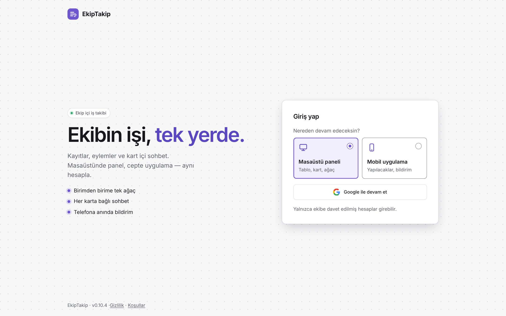

### 1.2 Panolar: günün özeti

Giriş yapınca Panolar açılır. Üstteki dört sayaç sana ve ekibe ait işi özetler: açık eylemlerin, geciken kayıtlar, atanmamış işler ve toplam açık kayıt.


### 1.3 Kenar çubuğu: tüm modüller

Soldaki çubuktan Görevler, Etkinlikler, Takımlar, Ekip, Pillar'lar ve Veri yönetimi'ne geçersin. Takımların ve pillar'ların kısayolları altta; üye rozeti hangilerinde olduğunu gösterir.

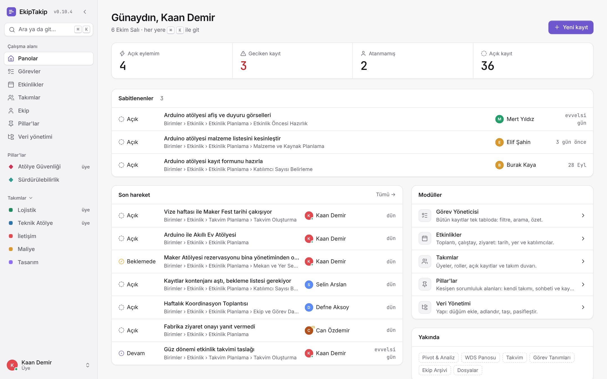

### 1.4 Geciken kayıtlara git

Kırmızı sayaç bir şey gecikmiş demek. Geciken kayıt kutusuna tıkla; liste doğrudan o filtreyle açılır.


### 1.5 Gecikenler tek listede

Son tarihi geçmiş kayıtlar (ve gecikmiş eylemi olanlar) burada. Gecikme yalnız renkle değil “1 gün gecikti” yazısıyla da belirtilir.

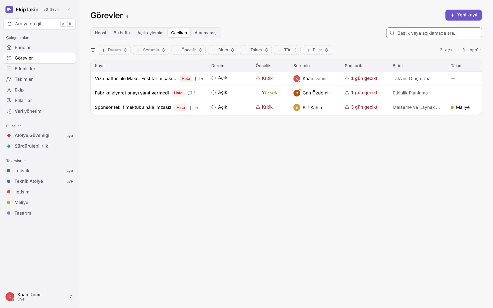

### 1.6 Her yere ⌘K ile git

Herhangi bir sayfada ⌘K (Windows'ta Ctrl+K) komut paletini açar. Kayıt, etkinlik, takım ve sayfa aramak için tek kutu.


### 1.7 Aradığını yazarak bul

“arduino” yazınca eşleşen kayıtlar ve etkinlikler listelenir. Enter ile açılır, Esc ile kapanır.

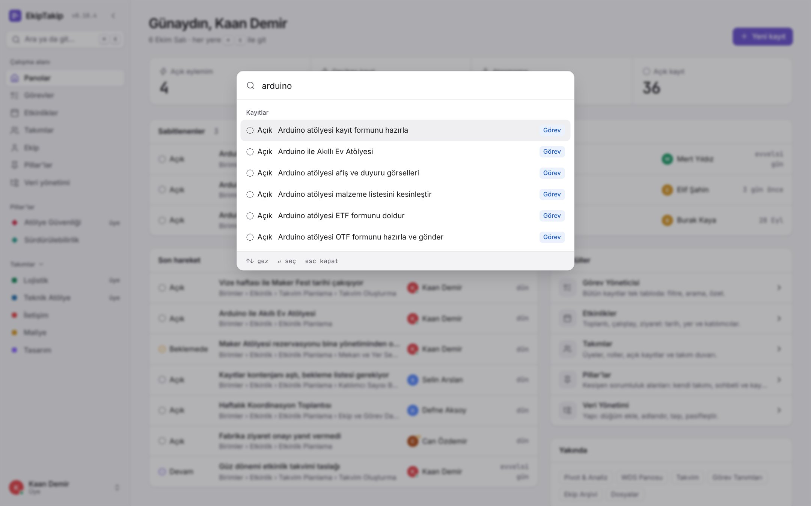


<a id="bolum-2"></a>
## 2. Görevler: haftayı tara

*Kaan Demir — Etkinlik koordinatörü.* Kaan işe önce Görevler tablosuna bakıyor: neyin sırası geldi, hangisi kimde bekliyor, hangisi gecikti?

### 2.1 Görevler'i aç

Kenar çubuğundan Görevler'e tıkla. Bütün kayıtlar tek tabloda toplanır.


### 2.2 Tabloyu oku

Her satır bir kayıt. Hata (kırmızı) bir şeyin ters gittiğini, Görev (mavi) yapılacak işi gösterir. Etkinlik etiketi kaydın bir etkinliğin kendi kaydı olduğunu, balon simgesi mesaj sayısını söyler.


### 2.3 Sadece benim eylemlerim

Üstteki sekmeler hızlı filtredir. Açık eylemim, sana atanmış açık eylemi olan kayıtları getirir.


### 2.4 Önce bunlara bak

Liste kısaldı: Panolar'daki Açık eylemim sayacıyla aynı kayıtlar. Sekmeyi Hepsi'ne çevirerek tüm tabloya dön.

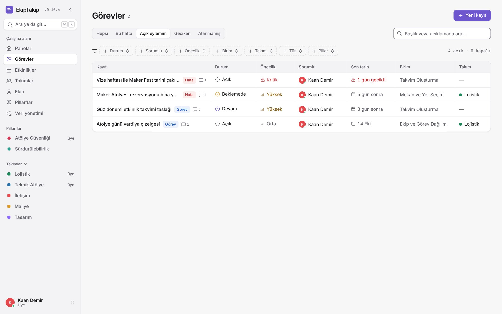

### 2.5 Durum filtresini aç

Filtre çipleri tek satırda durur. Boş çip kesikli çizgilidir; Durum'a tıkla.

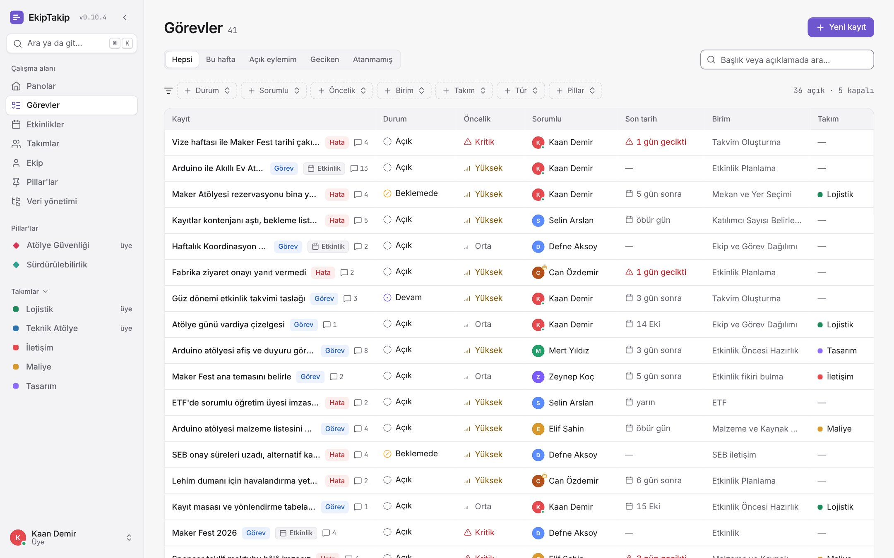

### 2.6 Durumu seç

Listeden Beklemede'yi seç: yalnızca bir yanıt, onay ya da malzeme bekleyen kayıtlar kalır.

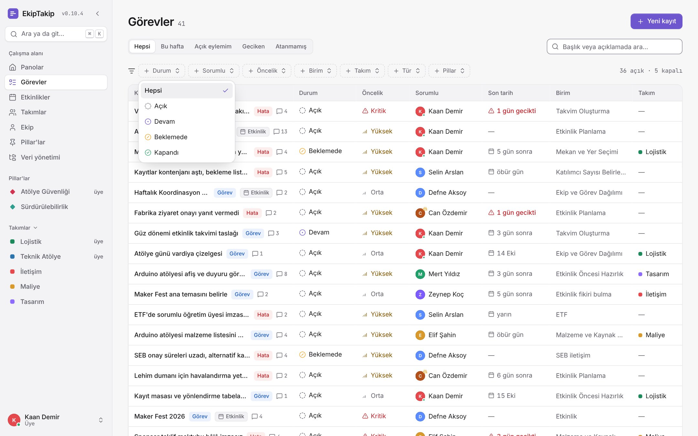

### 2.7 Filtre çipi dolu görünür

Seçili filtre koyu çipte yazar: Durum: Beklemede. Sağdaki sayaç kaç kaydın açık/kapalı olduğunu söyler. Filtreler adres çubuğuna yazılır; adresi kopyalayıp ekip arkadaşına gönderebilirsin.

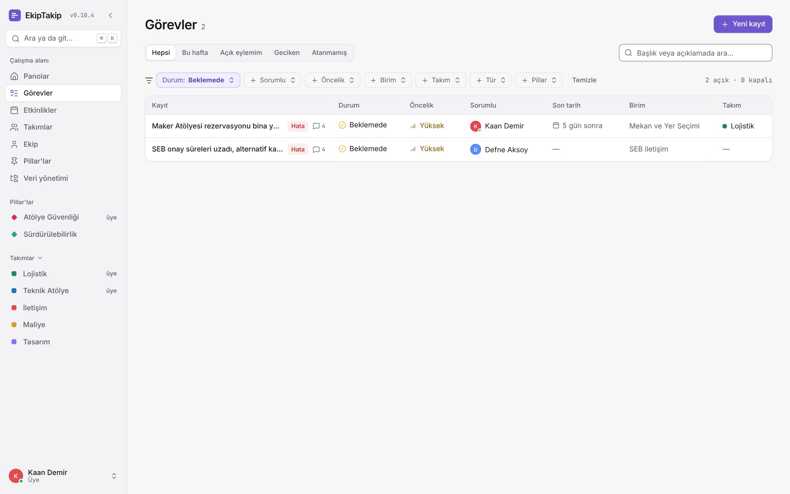

### 2.8 Birime göre süz

Birim çipi birim ağacını açar. Kayıtlar ağaçtaki yerlerine göre süzülür.


### 2.9 Ağaçta ara, favoriye ekle

Üstte Favoriler (yıldızla işaretlediklerin), altında ağaç durur. Okla dalı aç/kapa; arama kutusu eşleşen dalları kendiliğinden açar.

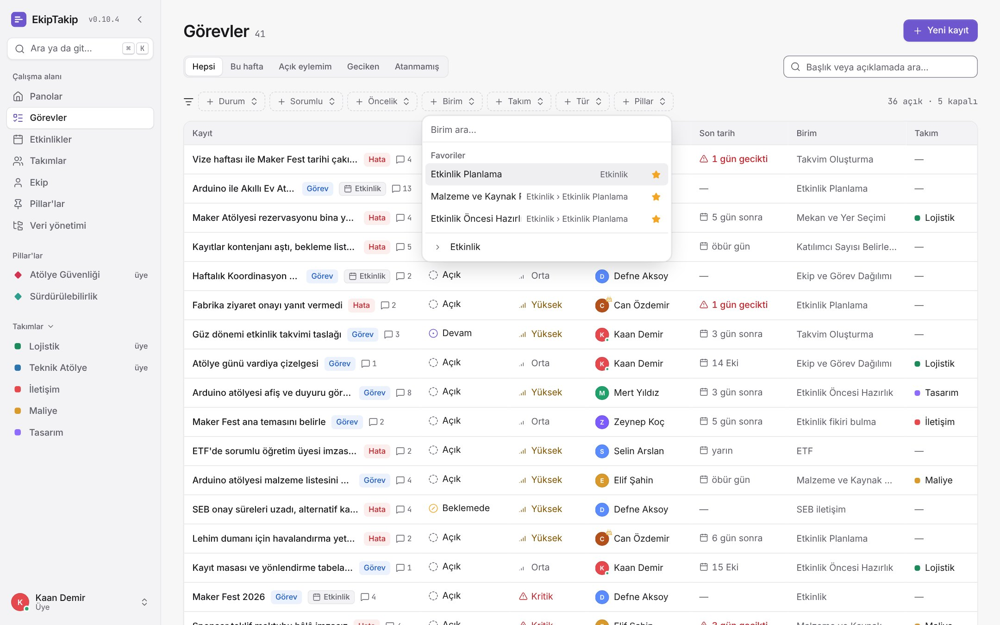

### 2.10 Yazdıkça daralır

“mekan” yazınca yalnız eşleşen birim ve üstündeki dallar kalır. Mekan ve Yer Seçimi'ni seç.

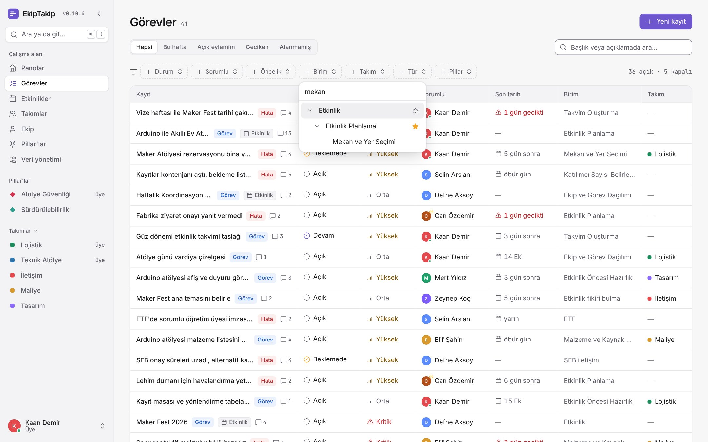

### 2.11 Birim filtresi uygulandı

Tablo yalnızca o birimdeki kayıtları gösterir. Çipin yanındaki × yalnız birim süzgecini kaldırır, Temizle hepsini.

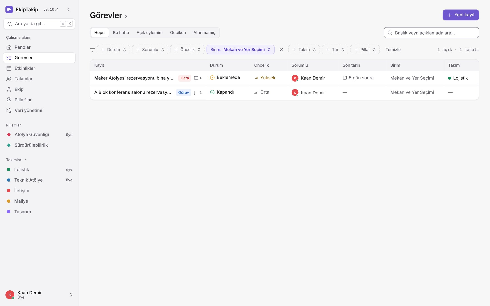

### 2.12 Başlıkta ve açıklamada ara

Arama kutusu başlık ve açıklamayı tarar; yazmayı bırakınca sonuçlar gelir. Türkçe karakterlere duyarsızdır (“afis” de “afiş”i bulur).

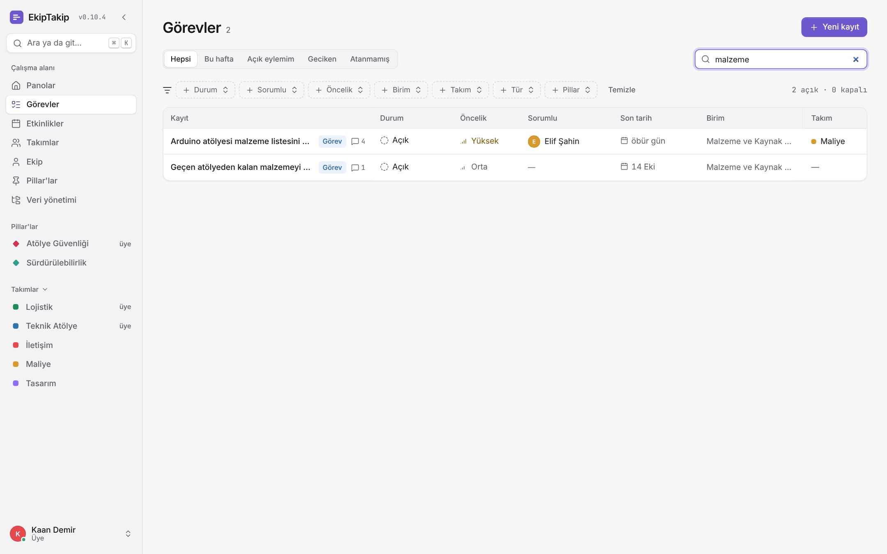

### 2.13 Sütun başlığına tıklayıp sırala

Son tarih başlığına tıkla: artan, bir daha tıkla: azalan, üçüncüde sıralama kapanır. Sütun kenarından sürükleyerek genişliği de ayarlayabilirsin.


### 2.14 En yakın tarih üstte

Tarihi olmayanlar sona gider. Sıralama tablo başına cihazında hatırlanır.

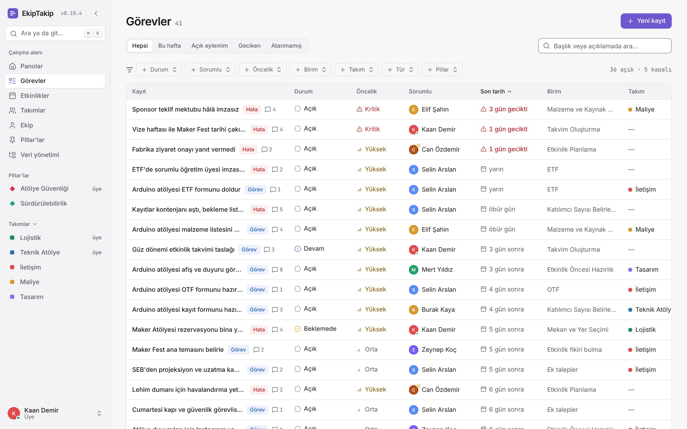


<a id="bolum-3"></a>
## 3. Yeni kayıt aç

*Kaan Demir — Etkinlik koordinatörü.* Atölye günü için ek prizler gerekiyor. Kaan bunu kayda dökerek sorumlusunu ve birimini belirliyor.

### 3.1 Yeni kayıt düğmesine bas

Görevler'de ya da Panolar'da sağ üstteki Yeni kayıt'a tıkla. Her üye her birimde kayıt açabilir.


### 3.2 Kısa ve aranabilir bir başlık yaz

Başlık en az 5, açıklama en az 30 karakter olmalı; sayaç altta görünür. Başlık, ekibin sonradan arayıp bulacağı şey.

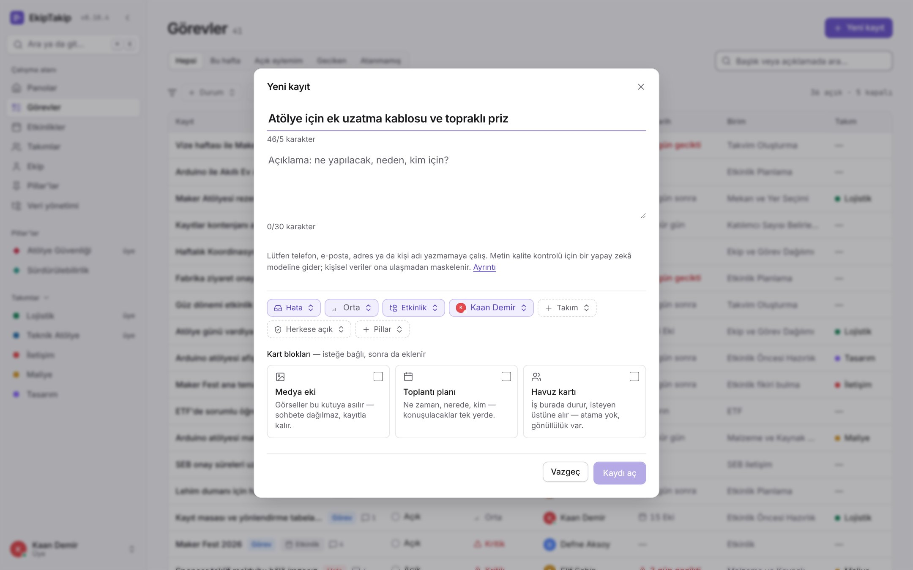

### 3.3 Ne, neden, kim için?

Açıklamaya işin ne olduğunu, neden gerektiğini ve kimin için olduğunu yaz. Kısa tutulursa kayıt açılmaz.


### 3.4 Hata mı, görev mi?

Tür çipinden seç: Hata bir şey ters gittiyse, Görev yapılacak bir iş içindir.


### 3.5 Görev'i seç

Bu bir iş: Görev'i seç.

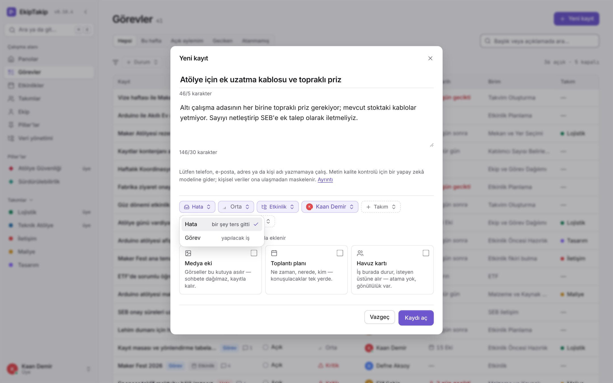

### 3.6 Kaydın ağaçtaki yerini seç

Birim kaydın hangi işe ait olduğunu söyler. Ağaç açılır; Favoriler'den hızlıca seçebilirsin.

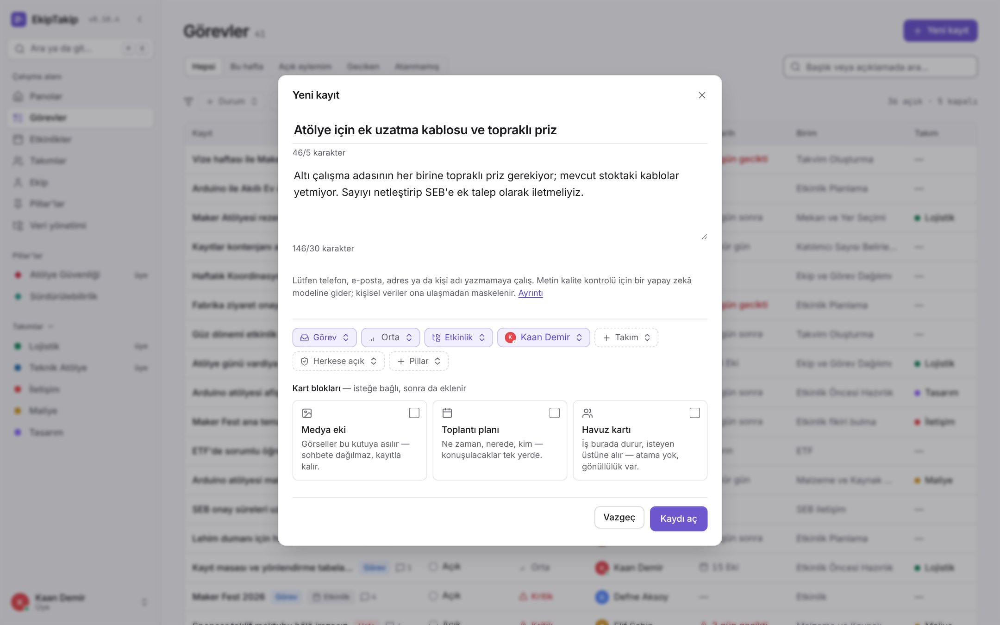

### 3.7 Malzeme ve Kaynak Planlama

Bu iş malzemeyle ilgili: Malzeme ve Kaynak Planlama'yı seç. Sıfırdan aramak için kutuya birimin adını yaz.

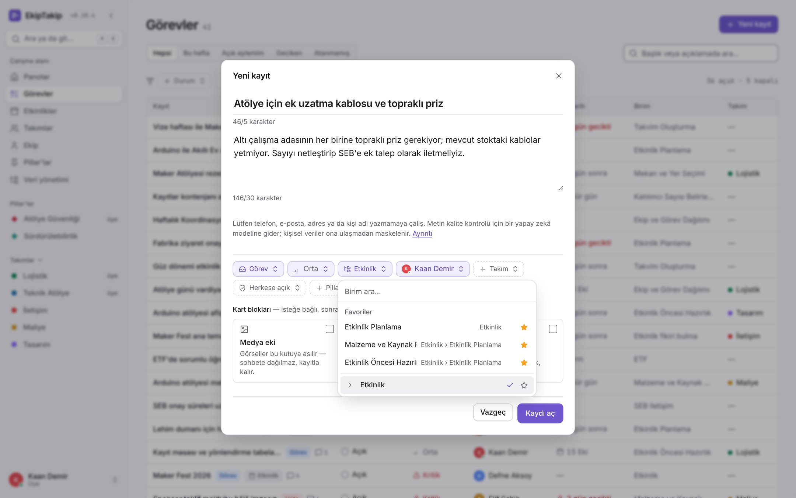

### 3.8 Sorumluyu seç

Varsayılan sorumlu kaydı açan sensin. Sorumlu çipinden başkasını seçebilir ya da Sorumlusuz açabilirsin.

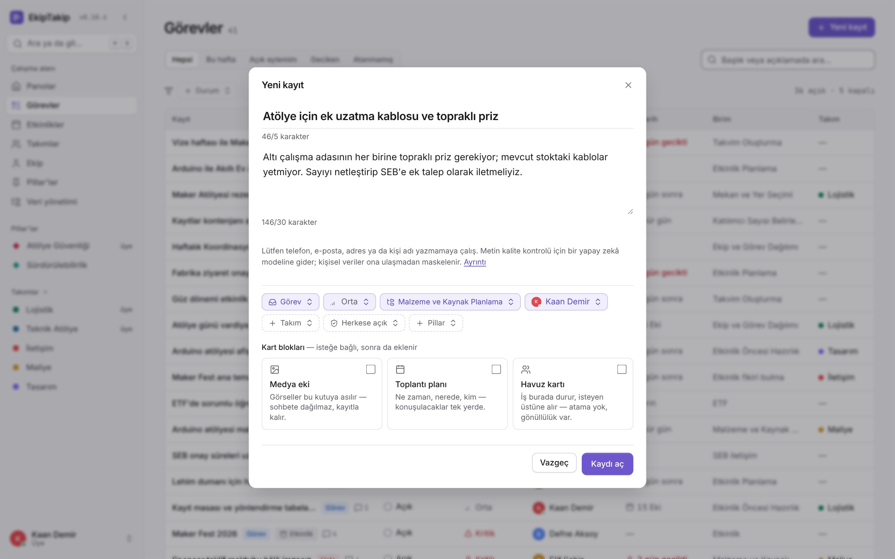

### 3.9 Can Özdemir'e ata

Prizleri sayacak kişi atölyeden sorumlu Can. Seçtiğin kişi kaydın sorumlusu olur; adı listelerde ve kayıt sayfasında görünür.

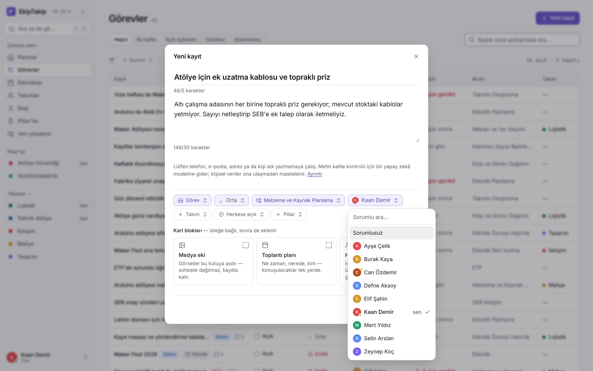

### 3.10 Takım ve öncelik

Takım çipi kaydı bir takıma bağlar: takımın üyeleri kaydı düzenleyebilir. Öncelik Kritik, Yüksek, Orta ya da Düşük olur.

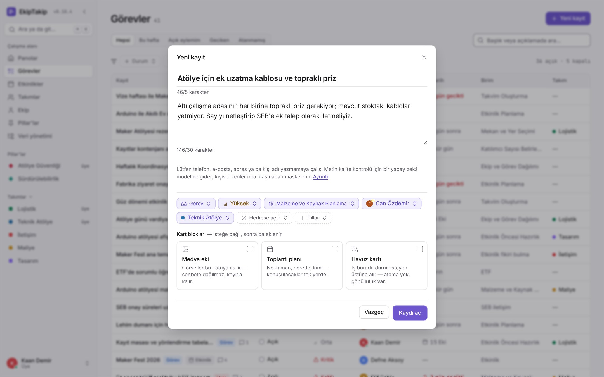

### 3.11 Kimler görsün?

Erişim: Herkese açık (herkes görür, tek tıkla katılır), İzinle katılım (sorumlu onaylar) ya da Gizli (içeriği yalnız katılımcılar görür).


### 3.12 Üç erişim kipi

Çoğu iş Herkese açık kalır. Hassas konular için Gizli'yi seç. Sonradan kayıt sayfasından değiştirilir.

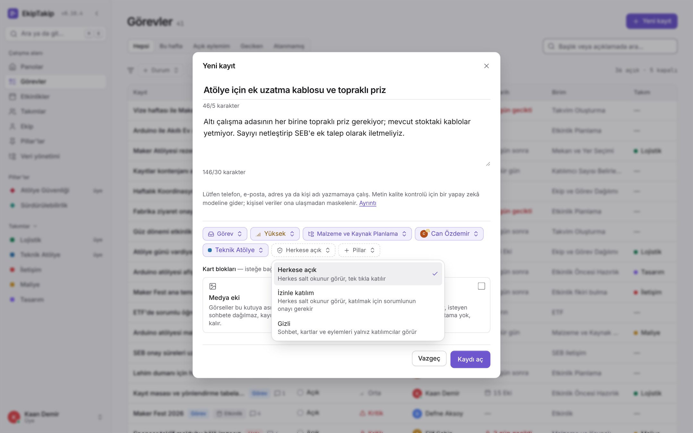

### 3.13 İstersen boş kart blokları ekle

Kart blokları isteğe bağlı: Medya eki (görseller), Toplantı planı, Havuz kartı (gönüllü topla). Kayıt açıldıktan sonra da eklenir.

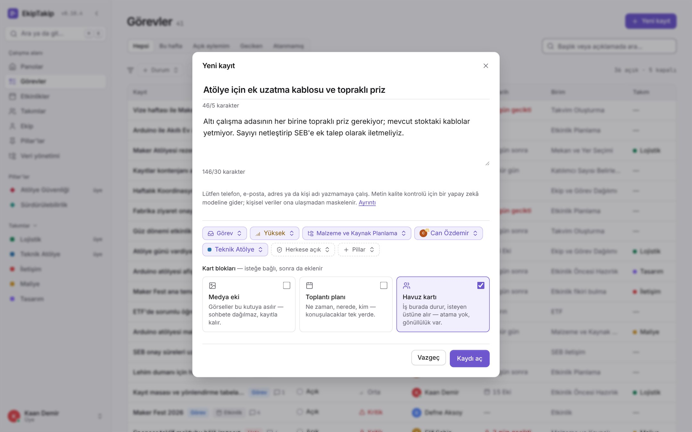

### 3.14 Kaydı aç

Her şey tamamsa Kaydı aç'a bas. Kayıt açılır ve doğrudan kayıt sayfasına gidersin.


### 3.15 Kayıt hazır

Yeni kayıt sayfası: üstte başlık, ortada özellikler ve eylemler, sağda sohbet. Bir sonraki bölümde bunları kullanacağız.

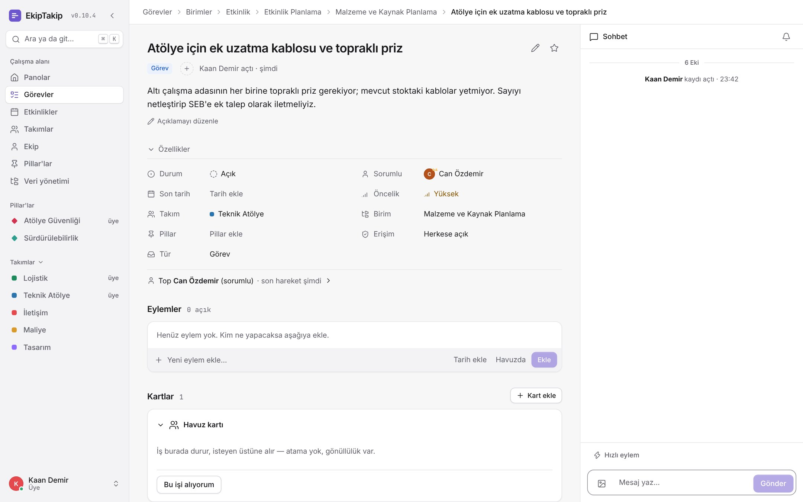


<a id="bolum-4"></a>
## 4. Kayıt sayfası: tarih, eylem, kişi

*Kaan Demir — Etkinlik koordinatörü.* Kaan az önce açtığı kaydı ekibe dağıtıyor: son tarih koyuyor, eylemleri sahipleriyle ekliyor, Elif'i işe dahil ediyor.

### 4.1 Kaydı listeden bul ve aç

Görevler'de arama kutusuna birkaç harf yaz, satırdaki başlığa tıkla. Kayıt kendi sayfasında açılır.

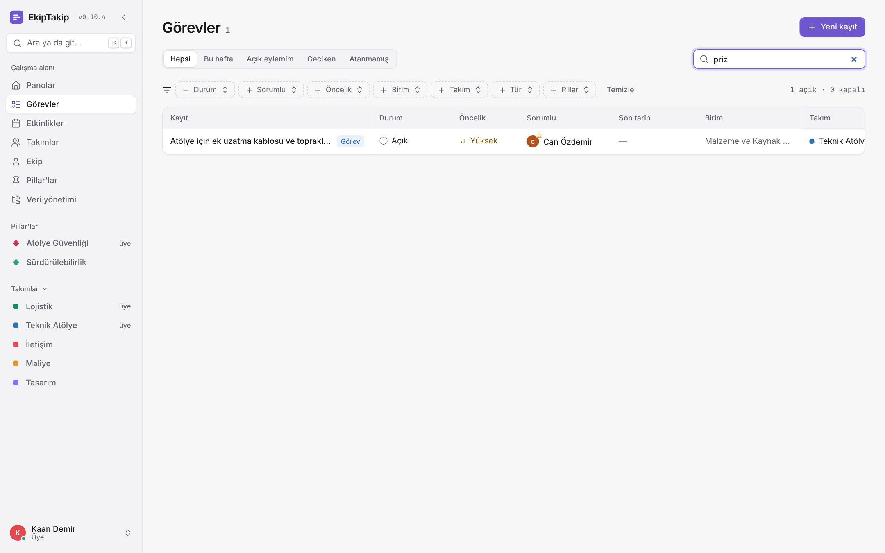

### 4.2 Kayıt sayfası beş bölümden oluşur

Üstte başlık ve açıklama, altında özellikler, sonra eylemler ve kartlar. Sağdaki sütun kaydın kendi sohbeti. Tek bir iş için gereken her şey bu sayfada.


### 4.3 Kayda son tarih ver

Son tarih satırındaki “Tarih ekle”ye tıkla. Tarihi olmayan işin ne zaman biteceği belli olmaz; gecikme de ancak tarih varsa görünür.


### 4.4 Takvimden günü seç

Takvim Pazartesi'den başlar. Hızlı seçim için Bugün, Yarın, +1 hafta düğmeleri var; ok tuşlarıyla da gezilir.

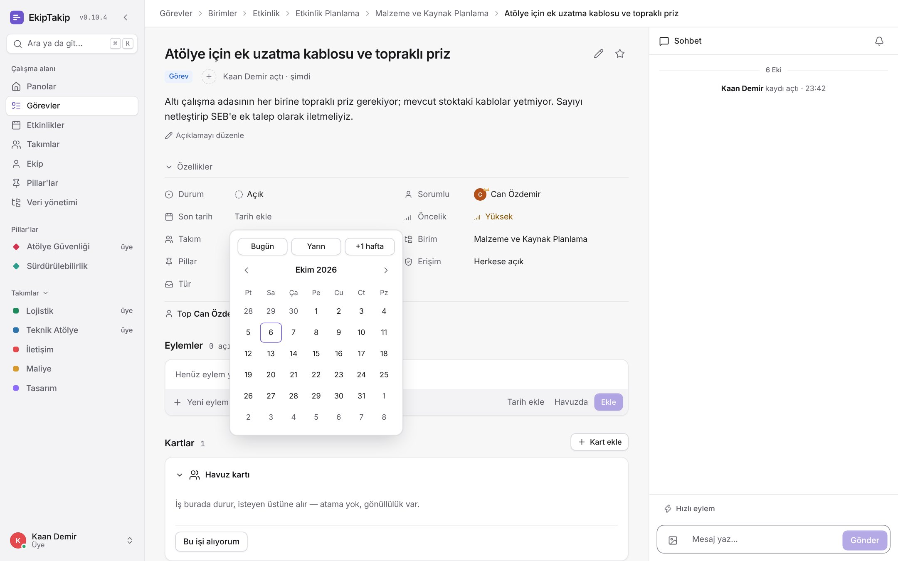

### 4.5 Kaydedildi — geri alınabilir

Değişiklik hemen kaydedilir. Alttaki bildirimde Geri al varsa yanlış seçimi birkaç saniye içinde geri çevirebilirsin.

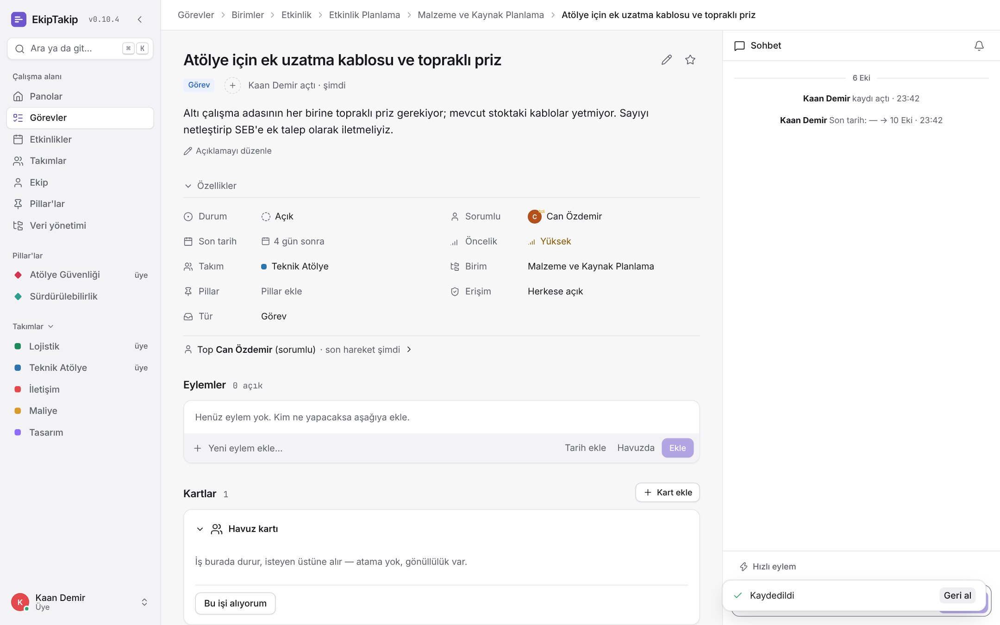

### 4.6 İşi eylemlere böl

Kayıt büyük bir iş; eylem onun içindeki tek kişilik adımdır. “Yeni eylem ekle…” kutusuna yapılacağı yaz: kim, ne yapacak?


### 4.7 Eylemin sahibini seç

Sahibi seçmezsen eylem Havuzda kalır: ekipten herkes “Üstlen” diyerek alabilir.

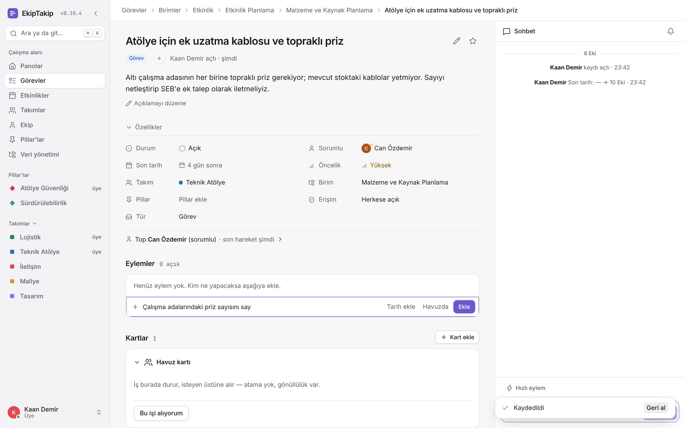

### 4.8 Can Özdemir'i seç

Sahip eylemin topunu tutan kişidir; eylem onun Panolar'daki Açık eylemim sayacına yazılır.

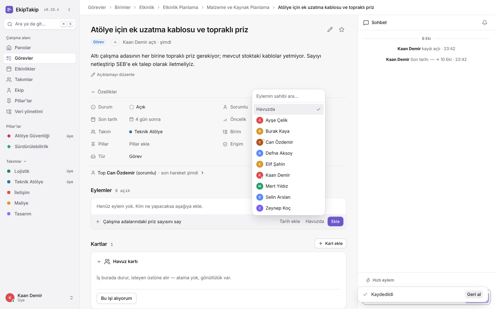

### 4.9 Eyleme de tarih koy

Her eylemin kendi son tarihi olur. Tarihi geçen eylem, kaydı da geciken listesine düşürür.

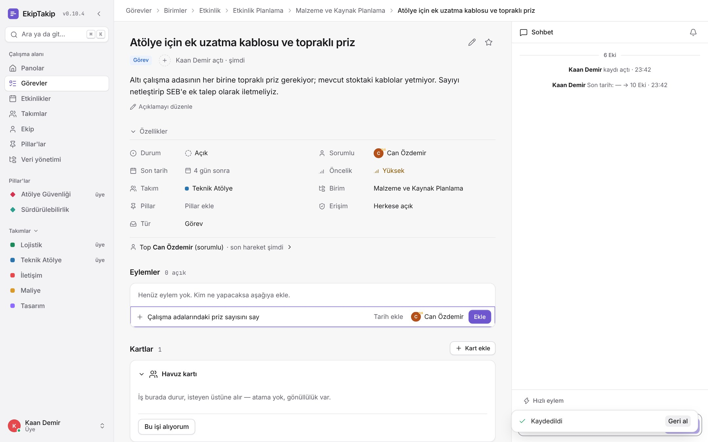

### 4.10 Ekle'ye bas

Başlık, sahip ve tarih tamamsa Ekle. Enter tuşu da aynı işi yapar.

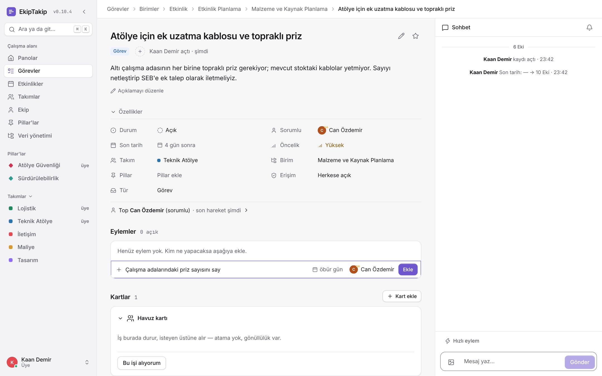

### 4.11 Eylemler sahipleriyle listelenir

Her satırda durum, başlık, tarih ve sahip var; hepsi satırın içinden değiştirilir. Başlıktaki “2 açık” sayacı bitmemiş eylem sayısıdır.


### 4.12 “Top kimde?” satırı

Özelliklerin altındaki satır işin şu an kimde beklediğini söyler: açık eylemlerin sahipleri ve son hareketin zamanı. Tıklayınca son güncellemeler açılır.

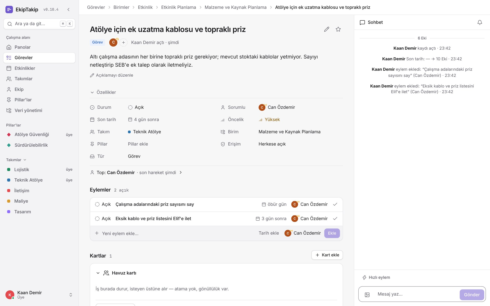

### 4.13 Son hareketler

Yöneticiler “bu iş neden durdu?” sorusunun cevabını buradan görür: en yeni eylem ve kayıt değişiklikleri üstte.

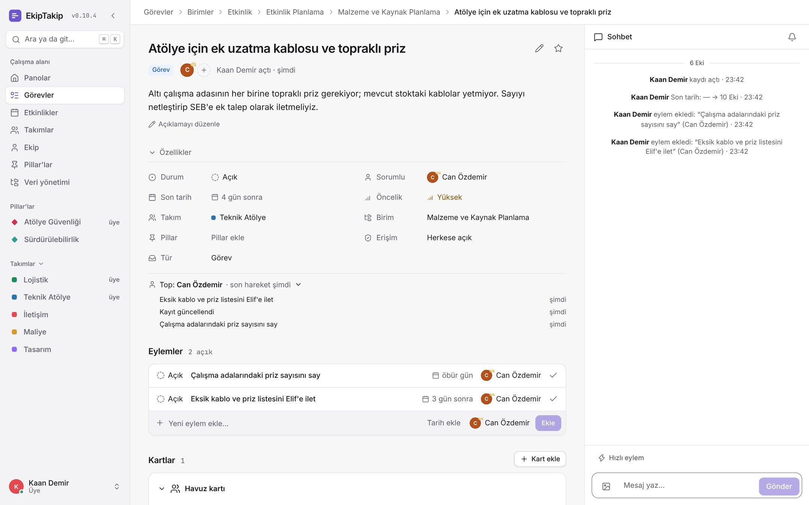

### 4.14 Başkalarını işe dahil et

Başlığın altındaki avatarlar kaydın katılımcıları. Küçük +'ya tıklayıp ekibi ekleyebilirsin; katılımcılar kaydı düzenleyebilir, sohbette bildirim alır.


### 4.15 Kişiyi işaretle

Arama kutusuna adını yaz ve kutucuğu işaretle. Kaldırmak için işareti geri al.

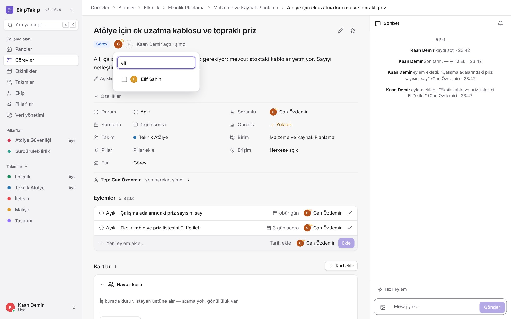

### 4.16 Elif artık katılımcı

Avatar yığınına Elif eklendi. Sohbette birini @ad diye anarsan o kişi de otomatik katılımcı olur (sohbet bölümünde göreceğiz).


### 4.17 Sık baktığın kaydı sabitle

Başlığın yanındaki yıldız kaydı Panolar'a sabitler. Takip ettiğin birkaç iş her sabah tek bakışta orada durur.

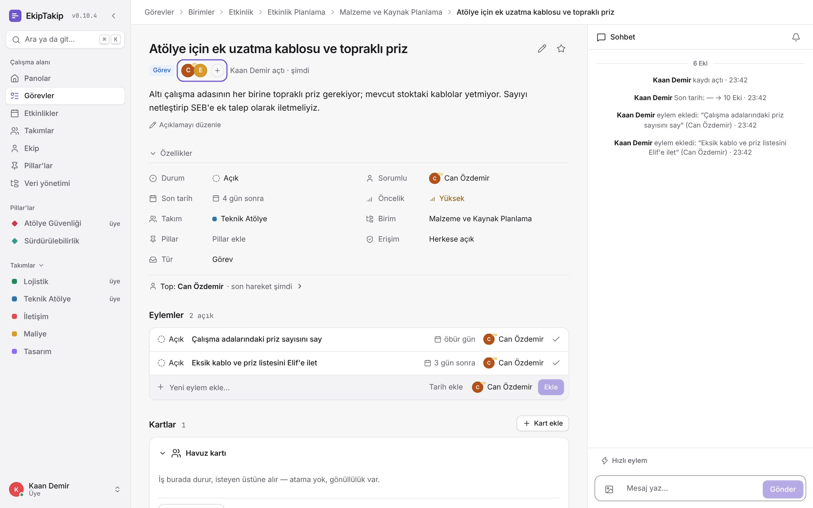

### 4.18 Panolar'da “Sabitlenenler”

Sabitlenen kayıtlar Panolar'ın en üstünde. Yıldıza bir daha basınca (“Sabitlemeyi kaldır”) listeden çıkar.

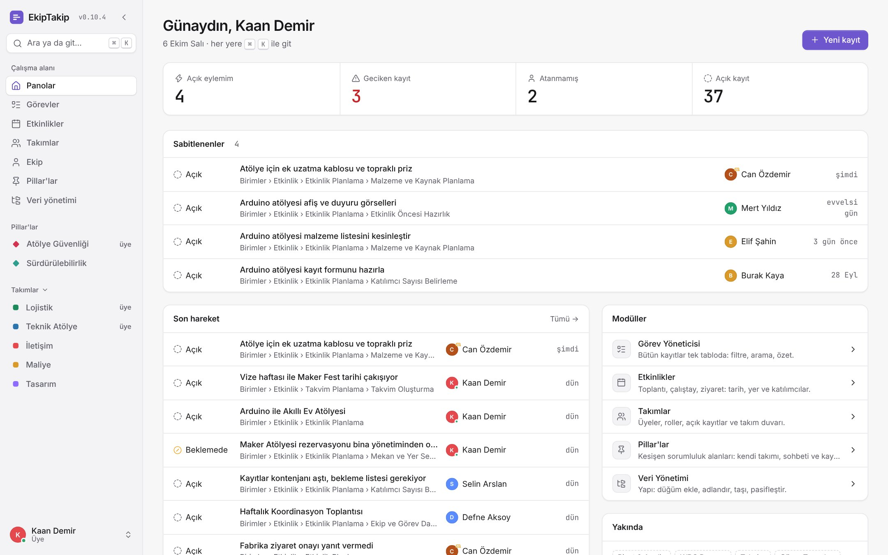


<a id="bolum-5"></a>
## 5. İşi bitir ve kaydı kapat

*Can Özdemir — Atölye sorumlusu.* Can kendisine atanan iki eylemi tek tek bitiriyor, sonra işin tamamını kapatıyor. Her kapanışta kısa bir not bırakıyor.

### 5.1 Güne “Açık eylemim” ile başla

Panolar'daki Açık eylemim sayacı, sana atanmış ve bitmemiş eylemleri sayar. Kaan'ın eklediği iki eylem de bu sayıya yazıldı. Sayaca tıkla.

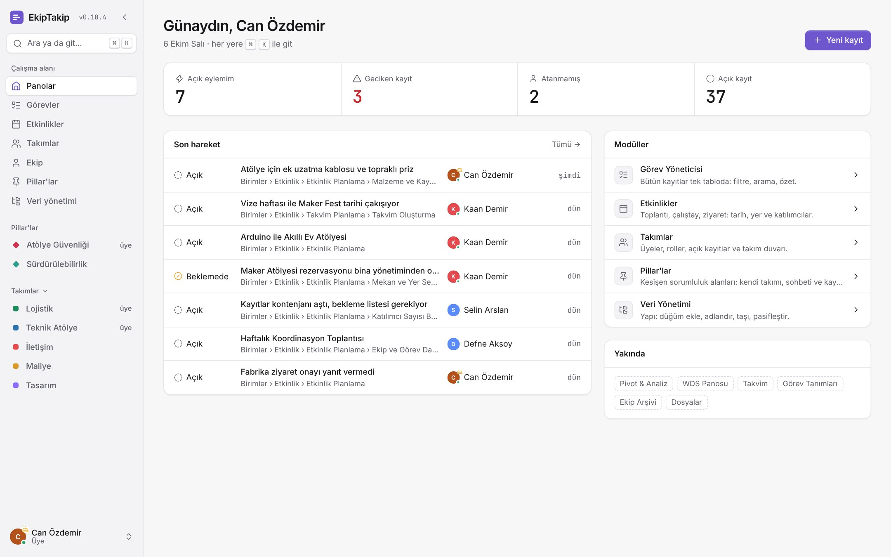

### 5.2 Sana ait kayıtlar listelenir

Liste yalnızca üzerinde açık eylemin olan kayıtları gösterir. Kaydı aç.

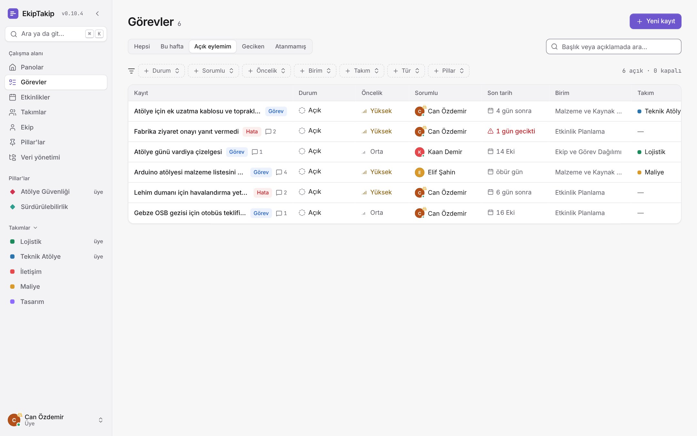

### 5.3 İşe başlayınca durumu güncelle

Kayıt Açık durumda. İşe başladığında Durum satırından değiştir; ekip kaydın ilerlediğini tabloda ve Panolar'da görür.

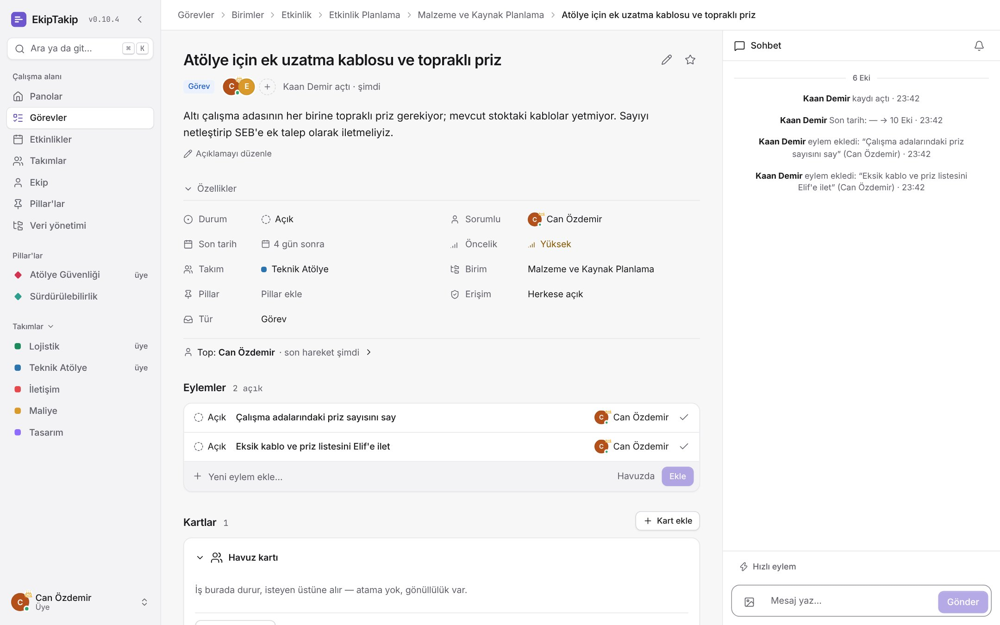

### 5.4 Devam'ı seç

Açık → Devam (üzerinde çalışılıyor) → Beklemede (başkasından yanıt, onay ya da malzeme bekleniyor) → Kapandı.

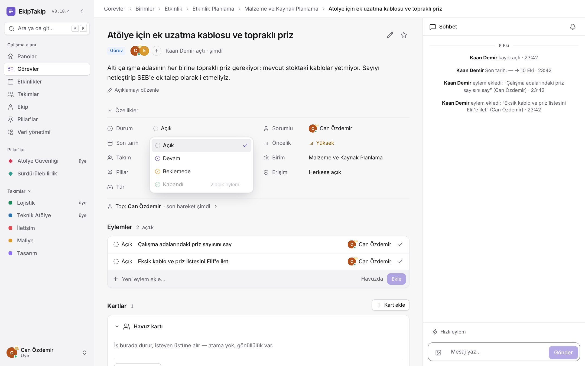

### 5.5 Eylemi bitir

Eylemin sağındaki ✓ düğmesi onu bitirir. Bitirirken bir kapanış notu istenir: ne yapıldı, sonuç ne?

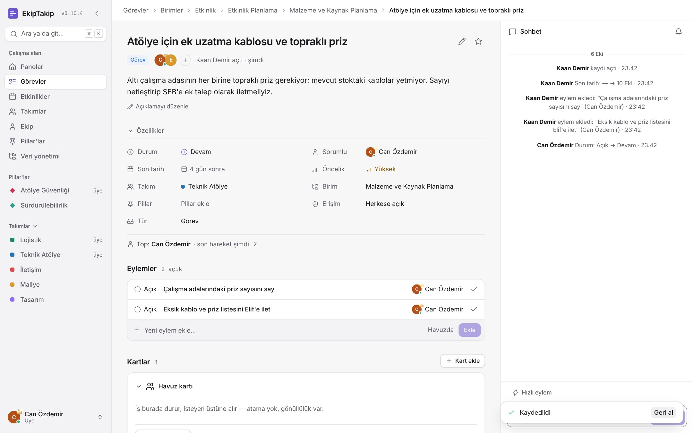

### 5.6 Kapanış notunu yaz

Not en az 30 karakter olmalı; sayaç altta. Sonradan “bu iş nasıl bitmişti?” diye bakan herkes bu satırı okuyacak.


### 5.7 Kapat'a bas

Not yeterliyse Kapat etkinleşir. Eylem biter, notu satırın yanında kalır.

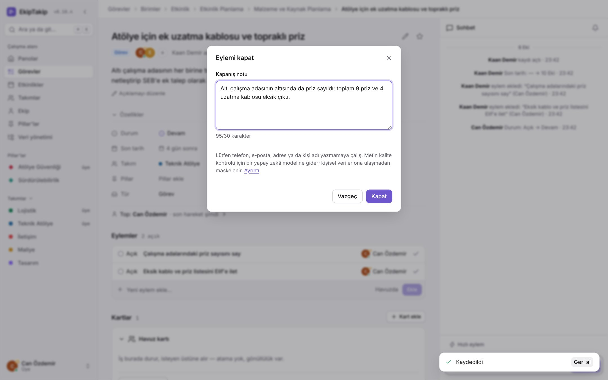

### 5.8 Eylem tamamlandı

Biten eylem listenin altına iner ve soluklaşır; başlıkta “1 açık · 1 bitti” yazar. Notu eylemin yanındadır.


### 5.9 Açık eylem varken kayıt kapanmaz

Durum listesinde Kapandı soluk ve yanında “1 açık eylem” yazıyor. Önce kalan eylemi bitirmen gerekir; kural reddedilince değil, daha seçmeden söylenir.

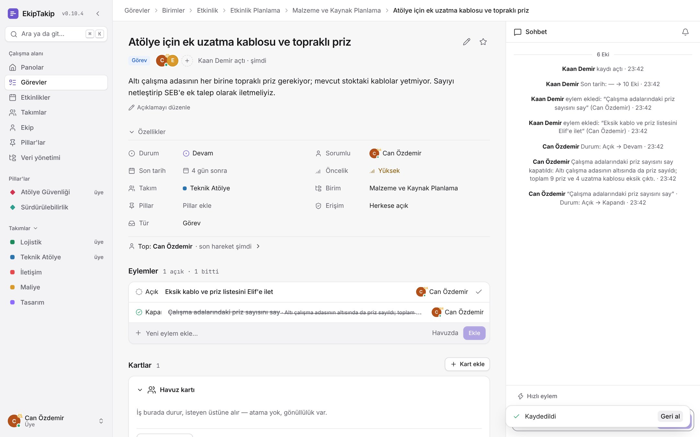

### 5.10 Kapandı seçilemiyor

Listeyi kapat (Esc) ve ikinci eylemi bitir.

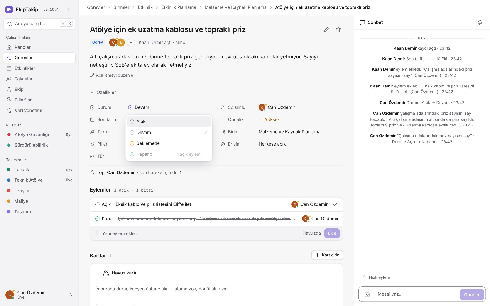

### 5.11 Şimdi kaydı kapatabilirsin

İki eylem de bitti, başlık “0 açık · 2 bitti” diyor. Durum'u tekrar aç.


### 5.12 Kapandı'yı seç

Kapandı artık seçilebilir. Seçince kaydın kapanış notunu soran pencere açılır.

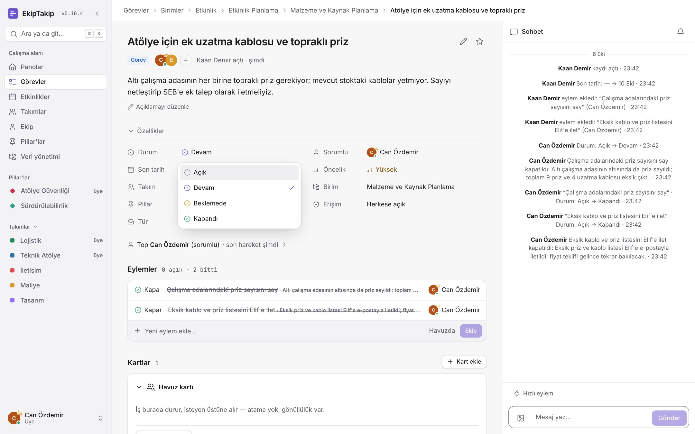

### 5.13 Kaydın kapanış notunu yaz

Kayıt notu, işin sonucunu özetler: ne yapıldı, geriye ne kaldı, kim devraldı. Yine en az 30 karakter.

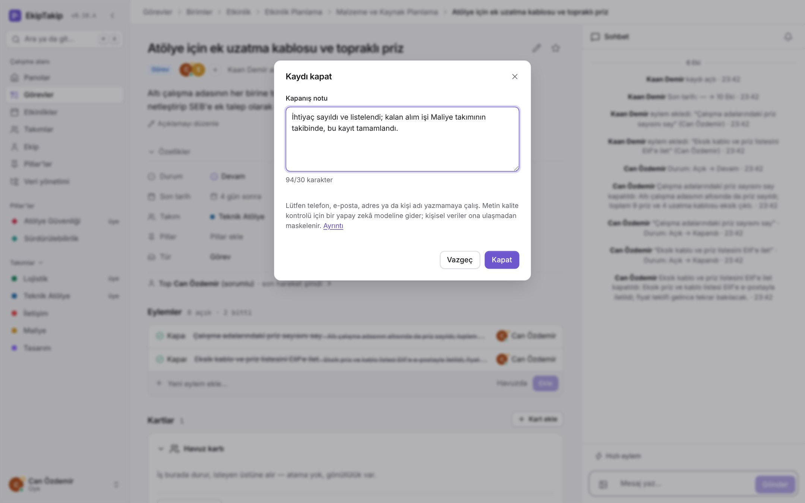

### 5.14 Kaydı kapat

Kapat'a bas. Kapalı kayıt silinmez; arşivde durur, istenirse Durum'dan yeniden açılabilir.


### 5.15 Kayıt kapandı

Durum Kapandı; kapanış notu açıklamanın altında görünür. “Top kimde” satırı kalktı çünkü iş bitti. Panolar'daki ve Görevler'deki açık sayıları da bir düştü.

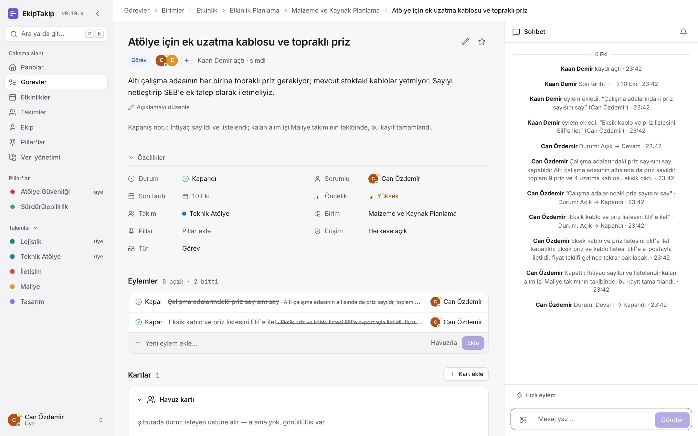


<a id="bolum-6"></a>
## 6. Sohbet: konuş, an, görsel paylaş

*Kaan Demir — Etkinlik koordinatörü.* Afiş taslakları hakkında konuşulan kayıtta Kaan baskı teklifine yanıt veriyor, Elif'i anıyor ve yerleşim planını paylaşıyor.

### 6.1 Sabitlediğin kaydı Panolar'dan aç

Panolar'daki Sabitlenenler listesi, takip ettiğin kayıtlara tek tıkla götürür.

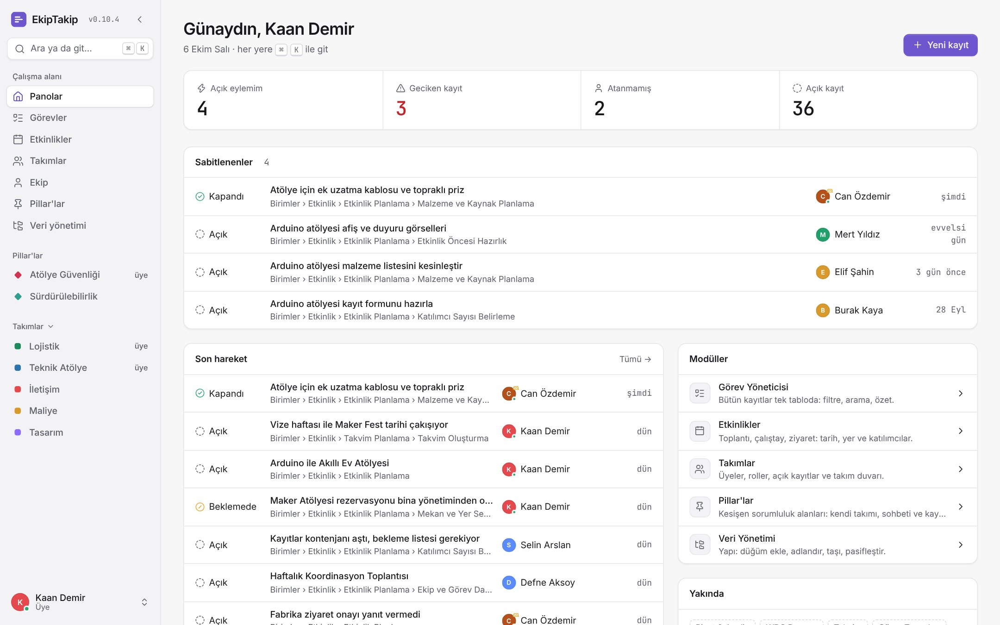

### 6.2 Her kaydın kendi sohbeti var

Sağdaki Sohbet sütunu bu işe özel. Mesajlar, görseller ve sistem satırları (durum, tarih, eylem değişiklikleri) tek akışta, zaman sırasıyla durur. Yeni mesajlar altta.

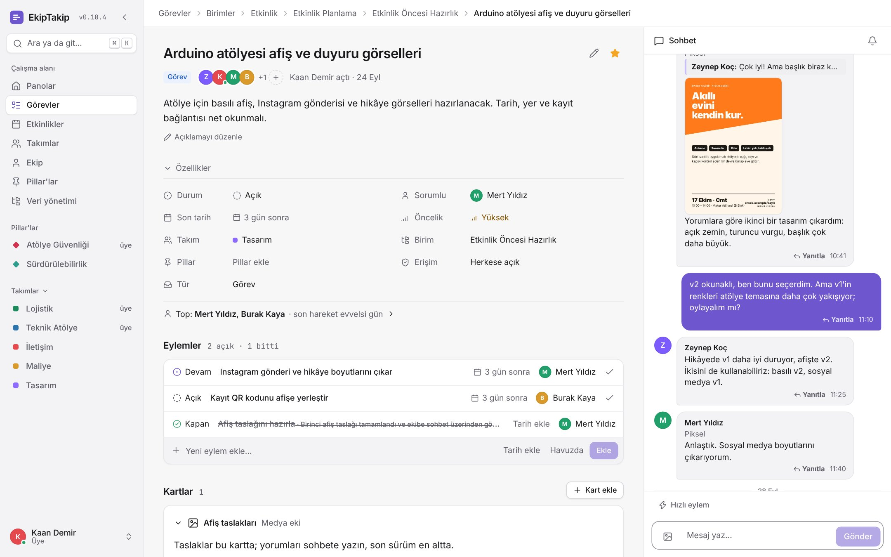

### 6.3 Görsele tıklayıp büyüt

Sohbette paylaşılan görseller küçük görünür. Tıklayınca pencerede tam boyutu açılır.


### 6.4 Tam boyutta incele

Pencerede görsel büyük görünür; Tam boyut yeni sekmede açar. Etiketleme yetkisi olanlar buradan etiket de ekler. Esc ile kapat.

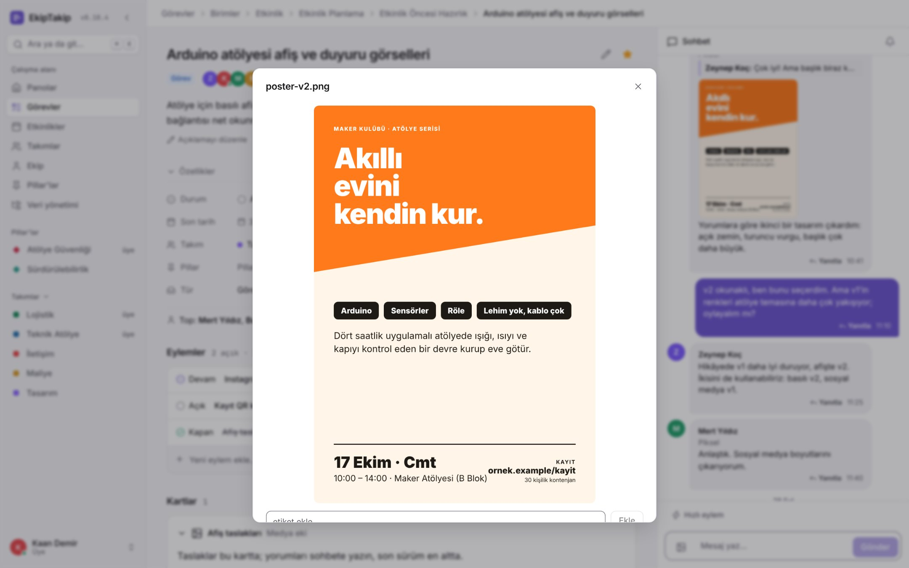

### 6.5 Bir mesaja yanıt ver

Mesajın altındaki Yanıtla, cevabını o mesaja bağlar; kalabalık sohbette neye cevap verdiğin belli olur.

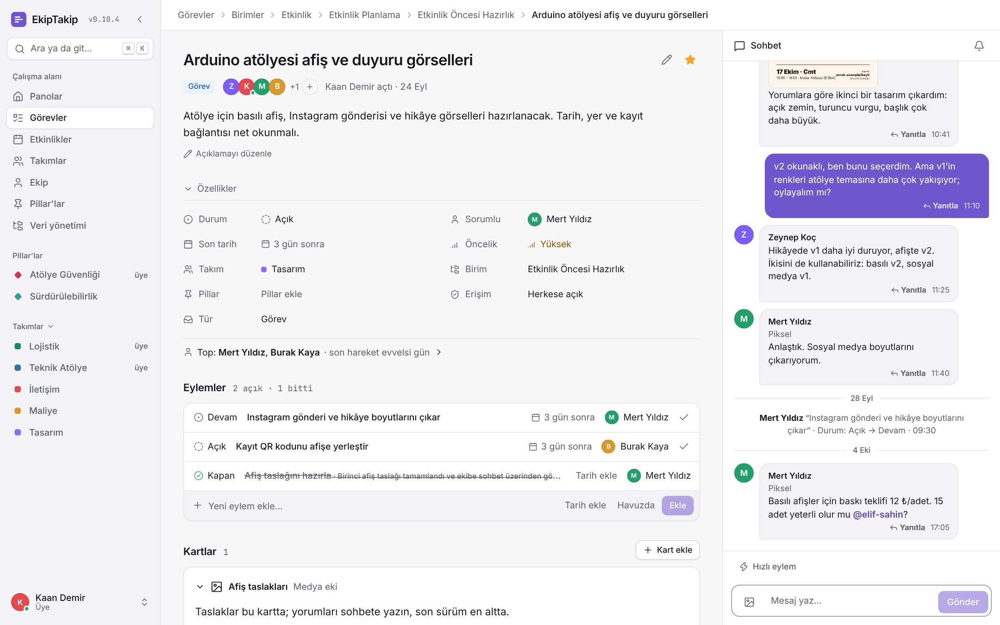

### 6.6 @ yazınca kişi önerilir

Adın başına @ koy: öneriler çıkar. Enter ya da Tab ilkini seçer. Anılan kişi bildirim alır ve kayda katılımcı olarak eklenir. Grup anmaları da var: @all (sohbetteki herkes), @here (son 10 dakikada görülenler), @team (kaydın takımı).


### 6.7 Mesajını tamamla ve gönder

Üstte yanıt verdiğin mesaj gri şeritte görünür (× ile vazgeçilir). Enter gönderir, Shift+Enter yeni satır açar; Gönder düğmesi de aynı işi yapar.


### 6.8 Mesajın gitti

Senin mesajların mor, başkalarınınkiler gri balonda. Anma vurgulu görünür; yanıt verdiğin mesaj balonun üstünde alıntılanır, tıklayınca ona kayar.


### 6.9 Görsel eklemek için resim simgesi

Mesaj kutusunun solundaki resim simgesi dosya seçtirir. Bir mesaja en fazla 4 görsel eklenir; yükleme seçer seçmez başlar.


### 6.10 Seçilen görsel mesajla gider

Dosya adı kutunun üstünde çıkar; yanlışsa × ile çıkarılır. Metin yazmak zorunlu değil: yalnız görsel de gönderilebilir.


### 6.11 Görsel sohbette

Görsel metnin üstünde görünür. Aynı görseli kayda kalıcı koymak istersen bir Medya eki kartı kullan (Kartlar bölümünde).


### 6.12 Sohbetten çıkmadan eylem aç

Konuşurken bir iş çıktıysa ⚡ Hızlı eylem'e bas: “kim ne yapacak?” formu pencerede açılır. Eylem, kaydın Eylemler listesine eklenir.


### 6.13 Başlığı yaz, sahibini seç

Yeni eylem formuyla aynı alanlar: başlık, tarih, sahip. Ekle'ye basınca pencere kapanır, eylem listeye düşer.


### 6.14 Bu sohbetin bildirimlerini ayarla

Sohbetin üstündeki zil sadece bu kayıt için bildirim düzeyini seçtirir: her hareket, yalnızca anıldığımda ya da sessize al. Kalabalık bir kaydı susturmak için ideal.


### 6.15 Düzeyi seç

Varsayılan, kişisel bildirim ayarını izler (profilinden değişir). Bir düzey seçersen yalnız bu sohbet için o geçerli olur.


<a id="bolum-7"></a>
## 7. Kartlar: havuz, oylama, toplantı

*Kaan Demir — Etkinlik koordinatörü.* Atölye günü için vardiya çizelgesi kaydında Kaan gönüllü toplamak ve ekibe bir şey sormak istiyor. Bunun için kayda kart ekliyor.

### 7.1 Kartlar: kayda eklenen küçük araçlar

Kayıt sayfasının Kartlar bölümü, yazıdan fazlası gereken işler için. Bu kayıtta zaten bir Medya eki (yerleşim planı) ve bir Toplantı planı var. Yeni kart için Kart ekle'ye bas.


### 7.2 Dört kart türü

Medya eki görselleri kayıtla birlikte tutar, Toplantı planı zaman ve yer bilgisi ile katılım sorar, Oylama ekipten tek soruda görüş toplar, Havuz kartı gönüllü arar. Kaan Havuz kartı'nı seçiyor.


### 7.3 Kart boş doğar, sen doldurursun

Yeni kartta yalnızca türün ipucu görünür. Kartın sağ üstündeki kaleme basıp başlık ve ayrıntıları gir.


### 7.4 Kaç kişi lazım, ne yapılacak?

Kişi sayısı hedefi, Ne yapılacak gönüllünün işini anlatır. Atama yok: isteyen kendisi “Bu işi alıyorum” der.


### 7.5 Gönüllü kartı hazır

Kart, ne kadar kişi gerektiğini yazar; kimler üstlendikçe adları altına eklenir. Bu kartı ekibe sohbetten @all ile duyurabilirsin.


### 7.6 Ekibe bir şey sormak için Oylama

Aynı menüden Oylama'yı seç. Sorunu ve seçenekleri yazacağın bir pencere açılır.


### 7.7 Soruyu ve seçenekleri yaz

Seçenek ekle ile en fazla 10 seçenek ekleyebilirsin. “Diğer” seçeneği işaretliyse kişi kendi cevabını yazar, ayrı sekmede toplanır. Altta medya, sayaç ve çoklu seçim opsiyonları var (yalnız oluştururken seçilir).


### 7.8 Oylama açıldı

Seçenekler yan yana listelenir; her seçeneğin yanında oy sayısı ve oran çubuğu var. Kimin neye oy verdiği görünmez, yalnızca sayılar.


### 7.9 Toplantı planı kartı

Toplantı kartı ne zaman, nerede, bağlantı ve gündem bilgisini tutar; altındaki üç düğme (Katılıyorum, Belki, Katılamıyorum) herkesin cevabını toplar. Kalemle düzenle.


### 7.10 Tarih ve saati takvimden seç

Ne zaman alanı gün + saat ister. Yer ve Gündem serbest metin; Bağlantı'ya çevrimiçi toplantı adresini yapıştır.


### 7.11 Kartların sırasını kendine göre ayarla

Birden çok kart varsa Düzeni düzenle sırayı değiştirtir. Sıra sana özeldir: başkalarının ekranını etkilemez.


### 7.12 Yukarı / aşağı oklarını kullan

Her kartta yukarı ve aşağı okları çıkar. Bitince Düzeni bitir'e bas. Kartın başlığındaki ok kartı katlar; katlanan kartlar cihazında hatırlanır.


<a id="bolum-8"></a>
## 8. Kartlara cevap ver: toplantı, oy, gönüllülük

*Selin Arslan — SEB iletişim sorumlusu.* Selin'e üç kayıtta üç şey soruluyor: toplantıya gelecek mi, forma hangi soruların konacağını düşünüyor, kayıt masasında gönüllü olur mu?

### 8.1 Toplantıya katılacak mısın?

Toplantı planı kartında zaman, yer ve gündem yazar. Altındaki üç düğmeden biriyle yanıt ver; yanıtlar herkese görünür ve kimin gelip gelmediği tek bakışta anlaşılır.


### 8.2 Yanıtın kayıtlı

Seçtiğin düğme mor dolu görünür, adın Katılıyorum satırına eklenir. Yanıtı değiştirmek için başka düğmeye bas; aynı düğmeye bir daha basarsan yanıtın geri çekilir.


### 8.3 Oylamada seçeneklere bas

Oylama kartında seçenek düğmesine basmak oy vermektir. Bu soruda birden çok seçenek işaretlenebilir: aklındaki her soruya bas.


### 8.4 Oyun sayıldı

İşaretlediklerin dolu görünür; sağdaki sayı o seçeneğe verilen oy, çubuk toplamdaki oranı gösterir. Oyunu değiştirmek ya da geri çekmek için seçeneğe tekrar bas.


### 8.5 Gönüllü olmak için işi üstlen

Havuz kartı atama yapmadan gönüllü arar: “3 kişi lazım”. İsteyen Bu işi alıyorum'a basar; adı kartın altında listelenir.


### 8.6 Havuz doldu

Üç gönüllü tamam: istenen kişi sayısına ulaşıldı. Fikrini değiştirirsen aynı düğmeye tekrar basıp işi bırakabilirsin.


<a id="bolum-9"></a>
## 9. Etkinlikler: takvime bak

*Kaan Demir — Etkinlik koordinatörü.* Kaan önümüzdeki haftaların etkinlik takvimini tarıyor: ne zaman, nerede, kim sorumlu, hangisi tarihsiz bekliyor?

### 9.1 Etkinlikler'i aç

Kenar çubuğundan Etkinlikler'e tıkla. Toplantı, atölye, gezi, festival: kulübün tüm etkinlikleri burada planlanır.


### 9.2 Sayfa üç parçadan oluşur

Sekmeler etkinlikleri zamana böler, tablo her etkinliğin tarihini, durumunu, önemini, sorumlusunu ve beklenen katılımcı sayısını gösterir, sağdaki takvim ayı ve yaklaşan etkinlikleri özetler.


### 9.3 Tabloyu oku

Her satır bir etkinlik: adı, türü (gri etiket), yeri ve bağlı kayıt sayısı. Durum etiketi (Fikir, Planlanıyor, Kesin, Yapıldı, İptal) etkinliğin ne aşamada olduğunu söyler.


### 9.4 Tarihi olmayanlar Havuz'da bekler

Fikir aşamasındaki, henüz tarihi konmamış etkinlikler Havuz sekmesinde durur. Tarih verilince otomatik olarak Planlanan'a geçer.


### 9.5 Havuzdaki fikirler

Tarih sütunu “Tarih yok” diyor. Fikri kesinleştirmek için etkinliği aç, bir tarih seç ve durumu Planlanıyor'a çek.


### 9.6 Geçmiş etkinlikler arşivde

Tarihi geçen etkinlikler Geçmiş'e düşer, en yenisi üstte. Yapıldı ya da iptal edilen etkinliklerin sohbeti, kayıtları ve formları da burada durur.


### 9.7 Türe göre süz

Tür, Önem ve Sorumlu çipleri tabloyu daraltır; arama kutusu etkinlik adı ve yerinde arar. Tür listesi Veri yönetimi'nden gelir.


### 9.8 Atölye'yi seç

Listede ekibin tanımladığı etkinlik türleri var. Atölye'yi seç: yalnız atölyeler kalır.


### 9.9 Süzgeç çipi doldu

Çipte Tür: Atölye yazar. Temizle tüm süzgeçleri kaldırır. Süzgeçler adres çubuğuna da yazılır; adresi paylaşınca aynı görünüm açılır.


### 9.10 Takvimdeki noktaya tıkla

Takvimde etkinlik olan günlerin altında renkli nokta var: renk önemi gösterir (kırmızı kritik, turuncu yüksek, mor orta). Güne ya da noktaya tıkla, etkinlik açılır. Ok düğmeleriyle aylar arasında gezilir.


### 9.11 Etkinlik sayfası açıldı

Takvimden doğrudan etkinliğin sayfasına geldik. Sonraki bölümlerde bu sayfanın parçalarını inceleyeceğiz.


<a id="bolum-10"></a>
## 10. Yeni etkinlik oluştur

*Kaan Demir — Etkinlik koordinatörü.* Ekip kasım ayında bir lehimleme atölyesi daha yapmak istiyor. Kaan etkinliği oluşturuyor; tür seçilince plan kendiliğinden geliyor.

### 10.1 Yeni etkinlik düğmesine bas

Etkinlikler sayfasında sağ üstteki Yeni etkinlik'e tıkla. Etkinlik hem takvimde hem kendi sayfasında hem de bir kayıt olarak (sohbet ve arşiv için) açılır.


### 10.2 Adı ve açıklamayı yaz

Ad en az 5, Açıklama en az 30 karakter olmalı. Açıklamada ne yapılacağını, neden ve kimin için olduğunu söyle; OTF ve duyurular bu metne dayanır.


### 10.3 Etkinlik türünü seç

Tür etkinliğin hangi planla yürüyeceğini belirler. Türler Veri yönetimi → Etkinlik Türleri altında tanımlıdır.


### 10.4 Atölye'yi seç

Listede ekibin tanımladığı türler var: toplantı, atölye, eğitim, saha ziyareti, konferans, yarışma, sosyal etkinlik.


### 10.5 Tür seçince plan hazır gelir

Atölye şablonu otomatik yüklenir: etkinliğe bağlanacak widget'lar (OTF formu, satın alımlar) ve zaman çizelgesi adımları, etkinlik gününe göre kaç gün önce yapılacaklarıyla birlikte.


### 10.6 Etkinliğin kaydı hangi birimde dursun?

Birim, etkinliğin kendi kaydının (sohbet + arşiv) açılacağı yeri seçer. Etkinlik işleri için genelde Etkinlik Planlama uygundur.


### 10.7 Etkinlik Planlama'yı seç

Birim ağacı kayıtlardaki ağaçla aynı: favoriler üstte, aranabilir, dallar açılıp kapanır.


### 10.8 Tarihi seç (ya da boş bırak)

Tarih boş bırakılırsa etkinlik Havuz'a düşer; fikir aşamasında tarih gerekmez. Tarih verince etkinlik takvimde görünür.


### 10.9 Ayı ve günü seç

Ay okları takvimi ileri geri sürer. Cumartesi atölyeleri için kasımın uygun Cumartesi gününü seç; gün seçilince takvim kapanır.


### 10.10 Oluştur

Alanlar tamamsa Oluştur etkinleşir. Etkinlik, kaydı ve şablondaki adımlar tek seferde açılır; doğrudan etkinliğin sayfasına geçersin.


### 10.11 Etkinlik hazır

Sayfada zaman çizelgesi (sağ üst) ve widget'lar (OTF formu, satın alımlar) şablondan geldi. Adımların tarihleri etkinlik gününe göre hesaplandı: örneğin OTF son gönderim tarihi kendiliğinden görünür.


### 10.12 Yeri listeden seç

Etkinlik açılınca Özellikler'den eksikleri tamamlarsın. Yer listesi Veri yönetimi → Etkinlik Yerleri'nden gelir; listede yoksa Diğer… (yaz) ile serbest metin girebilirsin.


### 10.13 Maker Atölyesi'ni seç

Ortak yerleri listeden seçmek yazım hatalarını önler; OTF formu ve takvim bu adı kullanır.


### 10.14 Başlangıç saatini ekle

Tarih verildiği için Saat ekle çıktı (tarihsiz etkinliğin saati olmaz). Tıkla, saati yaz, Kaydet'e bas.


### 10.15 Beklenen kişi sayısını yaz

Katılım, OTF formundaki katılımcı sayısı ve takvimdeki kişi sütunu olarak kullanılır. Sayıyı yazıp Kaydet.


### 10.16 Özellikler tamam

Etkinliğin tarihi, saati, yeri ve katılımı dolu. Her değişiklik sohbet akışına ve etkinliğin kaydına yazılır; önem ve sorumluyu da aynı satırlardan değiştirebilirsin.


<a id="bolum-11"></a>
## 11. Zaman çizelgesi: adımı bitir, onay iste

*Zeynep Koç — Duyuru ve sosyal medya.* Zeynep Arduino atölyesinin duyurusunu yaptı. Etkinliğin zaman çizelgesinde bu adımı tamamlandı olarak işaretlemek istiyor; ama onaylayıcı o değil.

### 11.1 Etkinliği listeden aç

Etkinlikler tablosunda satırın herhangi bir yerine (ya da başlığına) tıkla; etkinliğin sayfası açılır.


### 11.2 Sağ üstte etkinliğin zaman çizelgesi

Etkinliğe giden yol adımlara bölünmüş. Dolu nokta yapılmış adım, halkalı nokta sıradaki, kesikli nokta sonraki adımlar. Tarihler etkinlik gününe göre türden gelir.


### 11.3 Adımı bitirince noktaya bas

Duyuru yayınlandı: Duyuru yapıldı noktasına tıkla. Etkinliğin sahibi ya da etkinlik yöneticisi değilsen adım hemen işaretlenmez, onay istenir.


### 11.4 Onay istendi

Alttaki bildirim “Onay istendi” diyor, adımın yanında onay bekliyor yazıyor. Onay isteği etkinliğin sorumlusuna (ve etkinlik yöneticilerine) görünür; onaylayınca nokta dolar.


<a id="bolum-12"></a>
## 12. Etkinlik sorumlusu: onayla ve planı düzenle

*Kaan Demir — Etkinlik koordinatörü.* Zeynep'in isteği Kaan'a düştü. Kaan onaylıyor, sonra planda bir adımın tarihini kaydırıp kayıt masası için yeni bir adım ekliyor.

### 12.1 Onay istekleri sayfanın en üstünde

Etkinliğin sorumlusu ve etkinlik yöneticileri, bekleyen onay isteklerini sayfanın en üstünde sarı kutuda görür: kim, hangi adımı, ne yapmak istiyor. Bu istek Zeynep'ten.


### 12.2 Onayla ya da Reddet

Duyuru gerçekten yapıldıysa Onayla'ya bas. Yapılmadıysa Reddet isteği siler, adım olduğu gibi kalır.


### 12.3 Adım tamamlandı

Nokta doldu ve satırda tamam yazıyor; kutu da kayboldu. Sorumlu ve yöneticiler adıma doğrudan basıp işaretleyebilir, onay istemeden.


### 12.4 Adımın tarihini değiştir

Etkinlik yöneticisi adımın altındaki tarihe tıklayıp kaydırabilir. Varsayılan etkinlikten 7 gün önce; etkinlik tarihi değişirse varsayılan tarihler onunla birlikte kayar.


### 12.5 Yeni günü seç

Takvimden yeni gün seç. Varsayılan (7 gün önce) düğmesi özel tarihi silip hesaplanana döner.


### 12.6 Plana yeni bir adım ekle

Zaman çizelgesinin başlığındaki +, şablonda olmayan bir adım eklemeni sağlar.


### 12.7 Adın adını yaz, istersen tarih seç

Tarihi boş bırakırsan adım etkinlikten 7 gün önceye düşer. Ekle'ye bas.


### 12.8 Yeni adım çizelgede

Adım çizelgeye eklendi. Şablondan gelen adımlar gibi bu da işaretlenebilir ya da yanındaki × ile kaldırılabilir.


<a id="bolum-13"></a>
## 13. Etkinliğe kişi, takım ve kayıt bağla

*Kaan Demir — Etkinlik koordinatörü.* Havya atölyesinin planı oturdu. Kaan şimdi ekibi kuruyor: eğitmeni ekliyor, takımları bağlıyor ve işleri kayıtlara bölüyor.

### 13.1 Etkinliğe kişi ekle

Sağ sütundaki Kişiler'in + düğmesi ekibi etkinliğe katar. Eklenen kişi etkinliği düzenleyebilir, etkinlik sohbetinde bildirim alır.


### 13.2 Kişiyi ara ve seç

Yazdıkça liste daralır. Can Özdemir'i seç; zaten ekli olanlar listede çıkmaz.


### 13.3 Can etkinlikte

Kişi listeye girdi. Yanındaki balon simgesi o kişiyle etkinlik sohbetinde yazışmayı başlatır (özel mesaj yok, sohbet kayıtta yapılır); × kişiyi etkinlikten çıkarır.


### 13.4 Takımları bağla

Takımlar bölümünün +'sı etkinliği bir ya da birkaç takıma bağlar: onlar için ayrı iş kaydı açabilirsin.


### 13.5 Teknik Atölye'yi seç

Takım listesi Takımlar sayfasındakiyle aynı. Atölye için eğitmenin takımı olan Teknik Atölye'yi bağla.


### 13.6 Takım için iş kaydı aç

Bağlı takımın yanındaki + Kayıt, takımı hazır gelen yeni bir kayıt formu açar. Oluşan kayıt etkinliğe otomatik bağlanır.


### 13.7 Formda takım zaten seçili

Pencere takımı (Teknik Atölye) doldurmuş geldi. Başlığı ve açıklamayı yaz, Birim'i seç, Kaydı aç'a bas.


### 13.8 Kayıt widget olarak bağlandı

Widget'lar altında yeni bir Kayıt kartı çıktı: kaydın durumu, eylemleri ve sahipleri etkinlik sayfasından izlenir. Başlığa tıklarsan kaydın kendi sayfasına gidersin.


### 13.9 Başka bir widget ekle

Widget ekle menüsünde Kayıt (var olan ya da yeni bir kaydı bağlar) ve eksikse OTF formu ile Satın alımlar bulunur. Diğer widget'lar için Etkinlik widget'larını düzenle yetkisi gerekir.


### 13.10 Kayıt'ı seç

Kayıt bir yer tutucu açar; ya yeni kayıt açarsın ya da mevcut bir kaydı seçersin.


### 13.11 Var olanı ekle

Etkinliğe bağlı olmayan kayıtlar arasında arama yaparak bağla. Örneğin vardiya çizelgesi birçok etkinliğe lazımdır; bir kayıt birden çok etkinliğe bağlanabilir.


### 13.12 Kaydı seç

Listede kayıt adı ve türü görünür. Seçince kart etkinliğe bağlanır; × yalnız bağlantıyı kaldırır, kayıt silinmez.


### 13.13 Etkinliğin sohbeti kaydında

Başlığın yanındaki takvim | balon düğmesi etkinlik sayfası ile etkinliğin kaydı arasında geçiş yapar. Sohbet ve arşiv kayıttadır; ikisi aynı etkinliğin iki yüzü.


### 13.14 Etkinlik kaydı

Burada etkinliğin sohbeti, eylemleri ve eklenen görseller durur. Etkinlik değişiklikleri (tarih, yer, kişi) sohbet akışına sistem satırı olarak düşer. Aynı düğmeyle etkinlik sayfasına dönülür.


<a id="bolum-14"></a>
## 14. Satın alımlar: malzemeyi takip et

*Elif Şahin — Bütçe ve satın alma.* Atölyeye iki hafta kala Elif malzeme listesini takip ediyor: hangisi onaylandı, hangisinin tedarikçisi yok, kritik olan ne bekliyor?

### 14.1 Satın alımlar widget'ı

Etkinliğin malzeme ve hizmet listesi burada tutulur. Her satırda önem, ad, tür (sarf / alet / hizmet), süreç noktaları, en iyi fiyat ve en yakın varış tarihi görünür. Zaten var işaretli malzemeler en alta iner.


### 14.2 Başlıktaki renkli nokta genel durumu söyler

Nokta, “gerekli” diye işaretlenmiş malzemelerin onay durumunu özetler: yeşil hepsi onaylı, turuncu onay bekleyen var, kırmızı kritik bir malzeme bekliyor. Şu an kırmızı: röle modülü gelmeden atölye testi yapılamaz.


### 14.3 Süreç adımlarını noktalarla ilerlet

Her malzemenin adımları var: Gerekli mi? → Tedarikçi bulundu → Onaylandı (sponsorlu olanlara Sponsor adımı da eklenir). Röle modülü tedarikçisi bulundu: ikinci noktaya bas.


### 14.4 Sipariş onaylanınca son noktaya bas

Onay gelince üçüncü noktaya bas; önceki adımlar da tamamlanmış sayılır. Dolu bir noktaya basmak o adımı ve sonrasını geri alır.


### 14.5 Kritik engel kalktı

Başlıktaki nokta kırmızıdan turuncuya döndü: artık kritik bekleyen yok, ama onay bekleyen başka malzemeler var.


### 14.6 Satıra tıklayıp tedarikçileri gör

Satırın solundaki oka tıklayınca tedarikçi tablosu açılır: bağlantı ya da telefon, fiyat ve varış tarihi. En ucuz teklif vurgulanır; tablo başlıklarına tıklayarak sıralayabilirsin.


### 14.7 Teklifleri kıyasla

Üç tedarikçi var; en düşük fiyatlı olan satır vurgulu. Satırın başlığındaki fiyat ve tarih bu tablodan otomatik hesaplanır, elle girilmez.


### 14.8 Yeni teklif ekle

Bağlantıyı (ya da telefon numarasını) yaz, fiyat ve varış tarihini gir, + Tedarikçi'ye bas. Eksik tarih ya da fiyat bırakılabilir.


### 14.9 En iyi fiyat güncellendi

Yeni teklif tabloya girdi ve daha ucuz olduğu için vurgulandı; satır başlığındaki fiyat da 4.290,00 ₺ oldu.


### 14.10 Listeye yeni malzeme ekle

Listenin altındaki kutuya malzeme ya da hizmet adını yaz, Ekle'ye bas. Yeni malzeme ilk adımda başlar; sonra noktalarla ilerletirsin.


### 14.11 Satırın ⋯ menüsü

Menüde üç şey var: Zaten var olarak işaretle (stokta olan malzeme sona iner, süreç adımları kalkar), Sponsorlu (adım ekle) ve Sil.


### 14.12 Sponsorlu malzemeye ek adım

Sponsorlu seçilirse süreç dört adıma çıkar: sponsor onayı da beklenir (DHT22 sensörü gibi). Sponsor çıkarsa menüden adımı kaldırırsın.


### 14.13 Dört adımlı süreç

Satırda artık dört nokta var: Gerekli mi? → Tedarikçi bulundu → Sponsor → Onaylandı.


<a id="bolum-15"></a>
## 15. OTF formu: doldur, gözden geçir, gönder

*Selin Arslan — SEB iletişim sorumlusu.* Üniversiteye etkinlikten en geç üç iş günü önce OTF gönderilmeli. Selin Arduino atölyesinin formunu daha önce doldurulmuş bir formdan başlatıp hazırlıyor.

### 15.1 Etkinlik sayfasındaki OTF widget'ı

OTF üniversitenin etkinlik talep formudur. Başlıkta son gönderim günü hesaplanır: etkinlikten 3 iş günü önce (hafta sonu sayılmaz). Tarih değişirse bu gün de kendiliğinden kayar.


### 15.2 Önceki formdan başlat

Otomatik doldur, etkinlikten gelmeyen alanları (amaç, danışman, ekipman talepleri, sorumlular) en son kaydedilen başka bir etkinliğin formundan kopyalar. Hazır bir kalıp olduğu için en hızlı yol bu.


### 15.3 Kopya gözden geçirilene kadar kilitli

Kopyalanan formun uyarısı çıktı: Word indir kilitli, çünkü eski etkinliğin bilgileri yeni etkinliğe karışabilir. Önce bu etkinliğe göre en az bir alanı güncelle, sonra “gözden geçirdim” de.


### 15.4 Etkinliğe özel alanları güncelle

Üstteki gri kutu etkinlikten gelir (ad, tarih, saat, yer, kişi sayısı); onlar burada değişmez. Amaç, bitiş saati, danışman, yaş grubu ve kazanımlar'ı bu etkinliğe göre yaz.


### 15.5 Talep edilen hizmetleri işaretle

Düzen, ses-görüntü, teknik, ağırlama, temizlik ve diğer hizmetler gruplar halinde. Kutuyu işaretlersen yanında adet kutusu çıkar: örneğin her katılımcı masası için 8 priz.


### 15.6 Etkinlik sorumlularını seç

Form en fazla 3 sorumlu ister; telefonları kişilerin profilinden gelir. Kopyalanan formdaki iki kişi duruyor, üçüncüyü ekle.


### 15.7 Kaan Demir'i ekle

Listeden kişiyi seç. Yok seçeneği o yuvayı boşaltır.


### 15.8 Kaydet

Form tek parça kaydedilir; Kaydet'e basmadıkça yazdıkların sunucuya gitmez (altta “Kaydedilmemiş değişiklikler indirilen dosyaya girmez” uyarısı çıkar). Vazgeç son kayıtlı hale döndürür.


### 15.9 “Formu gözden geçirdim”

Bu etkinliğe göre bir alan güncellediğin için onay kutusu etkinleşti. İşaretle: form gözden geçirildi sayılır ve Word indir açılır.


### 15.10 Word dosyasını indir

Word indir kayıtlı formla doldurulmuş .docx dosyasını indirir. Dosyayı kulüp mail adresinden, mailin konusuyla birlikte SEB'e gönder; son gün: etkinlikten 3 iş günü önce.


### 15.11 Dosya adını ve mail konusunu kopyala

SEB'in beklediği dosya adı ve mail konusu hazır gelir; yanlarındaki simgeyle kopyalayıp mailine yapıştır. Etkinlik adı ya da tarihi değişirse bunlar da güncellenir.


<a id="bolum-16"></a>
## 16. Takımlar: ekibini ve duvarını gör

*Kaan Demir — Etkinlik koordinatörü.* Kaan takımların neye baktığını, kimlerin üye olduğunu ve açık işleri görmek için Takımlar'a geçiyor; Teknik Atölye'nin duvarına bir not bırakıyor.

### 16.1 Takımlar'ı aç

Kenar çubuğundan Takımlar'a tıkla. Takım, birlikte çalışan insanlardır; ağaçtaki birimlerden bağımsızdır.


### 16.2 Her takım bir kart

Kartta takımın adı, açıklaması, çalıştığı birimler, üyeleri ve açık kayıt sayısı var. Üyesi olduğun takımlar önde ve Üyesin rozetiyle işaretli.


### 16.3 Takıma tıkla

Kartın herhangi bir yerine tıkla; takımın sayfası açılır. Aynı sayfaya kenar çubuğundaki takım listesinden de ulaşılır.


### 16.4 Takım sayfasının dört bölümü

Solda Üyeler (rolleriyle), Çalıştığı birimler ve takımın Kayıtlar'ı, sağda Takım duvarı. Her bölümün başlığına tıklarsan katlanır; katlama cihazında hatırlanır.


### 16.5 Takım duvarına not bırak

Takım duvarı takımın ortak sohbetidir. Takıma ait duyuruları, kısa soruları buraya yaz; üyelik değişiklikleri de akışa sistem satırı olarak düşer. Duvara yalnız takım üyeleri yazar, herkes okur.


### 16.6 Not duvarda

Mesajın takım üyelerine bildirim olarak gider. Grup anmaları da çalışır: @team yazarsan takımın tamamı anılır.


### 16.7 Bölümlerin sırasını kendine göre ayarla

Sayfa başlığındaki Düzen düğmesi bölümleri yukarı/aşağı taşıtır. Sıra yalnız senin cihazında geçerlidir; başkalarını etkilemez.


### 16.8 Oklarla taşı, bitince Düzeni bitir

Her bölümün başlığında yukarı ve aşağı okları çıktı. Bitirince Düzeni bitir'e bas.


### 16.9 Takım için kayıt aç

Kayıt aç, takımı hazır gelen yeni kayıt penceresini açar: takımın bütün üyeleri o kaydı düzenleyebilir.


### 16.10 Takım çipi dolu geldi

Pencere Yeni kayıt penceresinin aynısı; Takım alanı seçili geldi. Doldurup açabilir ya da Vazgeç diyebilirsin.


<a id="bolum-17"></a>
## 17. Takım kur, üye ve birim ekle

*Ayşe Çelik — Takım yöneticisi.* Ekip sponsor görüşmeleri için yeni bir takım kuruyor. Takım yönetme yetkisi olan Ayşe takımı açıyor, üyeleri rolleriyle ekliyor ve çalıştığı birimi bağlıyor.

### 17.1 Yeni takım düğmesi

Yeni takım düğmesi yalnız takım yönetme yetkisi (manage_teams) olanlara ve yöneticilere görünür. Diğer üyeler takımları görür ama kuramaz.


### 17.2 Ad, açıklama ve renk

Ad en az 5, açıklama (isteğe bağlı) en az 30 karakter olmalı. Renk, takımın kenar çubuğundaki noktasını ve kartını boyar.


### 17.3 Takım kuruldu, henüz üyesi yok

Takımın sayfası açıldı. Duvarda “Sponsorluk” takımını kurdu satırı var. Şimdi üye ekleyelim: Üyeler kutusunun üstüne gelince çıkan kalem simgesine bas.


### 17.4 Kutuyu düzenleme moduna al

Her kutunun kalemi o kutuyu düzenleme moduna alır: ekleme ve çıkarma denetimleri yalnız bu modda görünür, böylece yanlışlıkla bir şey silinmez.


### 17.5 Kişiyi seç

Kişi ekle… listesinden takıma katılacak kişiyi seç; arama kutusu kişi çoğalınca işine yarar.


### 17.6 Elif Şahin'i seç

Elif bütçe ve sponsor katkılarına bakıyor; takımın lideri olsun.


### 17.7 Rolünü seç

Takımda üç rol var: Lider, Mentor ve Üye. Rol yalnız bilgilendirme içindir; kayıt yetkisi vermez (kayıt yetkisi takım üyeliğinden gelir).


### 17.8 Lider'i seç

Rolü seçince liste kapanır; Ekle ile üyeliği kaydet.


### 17.9 Ekle'ye bas

Kişi takıma eklenir; duvara da “Elif Şahin kişisini takıma ekledi (Lider)” satırı düşer.


### 17.10 Üye listesi

Düzenleme modunda her satırda rol seçici ve × (takımdan çıkar) var. Bitince sağ üstteki Bitti'ye bas.


### 17.11 Takımın çalıştığı birimi bağla

Çalıştığı birimler kutusu, takımı birim ağacının bir dalına bağlar (bir takım birden çok birimde çalışabilir). Bağlanan birim takım kartında ve Veri yönetimi'nde görünür; kayıtlar etkilenmez.


### 17.12 Birime bağla…

Birim ağacı açılır; aramayla bulup seç.


### 17.13 Malzeme ve Kaynak Planlama

Sponsorluk işleri malzeme ve kaynak planıyla ilgili: o birimi seç. Bağlantı hemen kurulur.


### 17.14 Takım hazır

Takımın üyesi ve birimi var; artık kayıtlar bu takıma atanabilir, duvar da kullanıma hazır.


<a id="bolum-18"></a>
## 18. Ekip, profil ve bildirimler

*Kaan Demir — Etkinlik koordinatörü.* Kaan bir ekip arkadaşının telefonuna ihtiyaç duyuyor, sonra kendi profilini ve bildirim tercihlerini gözden geçiriyor.

### 18.1 Ekip'i aç

Kenar çubuğundan Ekip'e tıkla: kulübün herkesi tek sayfada.


### 18.2 Herkesin profil kartı

Kartta ad, takma ad, rol rozetleri (yetki demetleri), telefon, doğum günü (yıl gösterilmez) ve üye olduğu takımlar var. Doğum günü olanın yanında pasta simgesi ve “bugün!” yazar.


### 18.3 Adla, takma adla ya da telefonla ara

Arama kutusu ad, takma ad ve telefon numarasında arar. Telefon numarasına tıklamak aramayı başlatır (telefonda).


### 18.4 Kendi bilgilerin sol-alttaki menüde

Sol altta adına tıkla: Profilim, Bildirimler, Tema (açık / koyu / sistem) ve Çıkış yap.


### 18.5 Profilim'i seç

Bilgilerini herkes kendi girer: başkasının profilini yalnız yöneticiler düzenleyebilir.


### 18.6 Fotoğraf, takma ad, telefon, doğum günü

Telefon zorunlu (ekip arkadaşların sana ulaşabilsin); biçimi kendiliğinden düzenlenir. Takma ad sohbette adının altında görünür, doğum günü Ekip sayfasında ve bugünse Panolar'da çıkar.


### 18.7 Bildirimler

Menüden Bildirimler'i seç: hangi hareketlerde haber alacağını sen belirlersin.


### 18.8 Varsayılan bildirim düzeyi

Her hareket, yalnızca anıldığımda ya da sessize al. Sessiz saat yalnız anlık bildirimi susturur, liste yine dolar. Bu cihaz bölümünden telefonda ya da tarayıcıda anlık bildirim açılır; bir sohbette farklı düzey için o sohbetin zil simgesini kullan.


<a id="bolum-19"></a>
## 19. Pillar'lar: kesişen sorumluluklar

*Kaan Demir — Etkinlik koordinatörü.* Bazı işler tek bir birime sığmaz: atölye güvenliği ya da sürdürülebilirlik gibi. Kaan bu kesişen alanları Pillar'lar sayfasından izliyor.

### 19.1 Pillar'lar'ı aç

Kenar çubuğundan Pillar'lar'a tıkla. Pillar, birimlerden bağımsız bir sorumluluk alanıdır: bir kayıt hem bir birimde (ne işi) hem de bir pillar'da (hangi alan) durabilir.


### 19.2 Pillar kartları

Her pillar'ın kendi takımı ve sohbeti vardır. Kartta açıklama, kişi sayısı ve açık kayıt sayısı görünür.


### 19.3 Atölye Güvenliği'ne tıkla

Pillar sayfası, takım sayfasına benzer: üyeler, kayıtlar ve sohbet.


### 19.4 Pillar sayfası

Üyeler, bu pillar'a bağlı kayıtlar (birimi ne olursa olsun), ileride gösterge panelleri için ayrılmış Göstergeler alanı ve sağda pillar sohbeti. Kayıtlara pillar bağlamak için kayıt sayfasındaki Pillar satırı kullanılır.


<a id="bolum-20"></a>
## 20. Veri yönetimi: birim ağacı

*Kaan Demir — Birim editörü.* Kayıtların hangi işe ait olduğunu söyleyen birim ağacı, Veri yönetimi'nde tutulur. Kaan Etkinlik dalının yapısına bakıyor ve yeni bir birim ekliyor.

### 20.1 Veri yönetimi'ni aç

Kenar çubuğundan Veri yönetimi'ne tıkla. Burası kayıtların, etkinliklerin ve formların dayandığı ortak listelerin düzenlendiği yer.


### 20.2 Üç kök liste

Birimler serbest bir ağaçtır (türünü ve yapısını sen seçersin). Etkinlik Türleri ve Etkinlik Yerleri yönetilen listelerdir. Kökler koddan gelir (kilit simgesi), yalnız adları ve açıklamaları değişir. Her değişiklik anında uygulanır.


### 20.3 Birimler'in okuna bas

Satırdaki ok alt dalları açar. Birimler'in altında tek dal var: Etkinlik.


### 20.4 Etkinlik dalı: hücre → makine → görev/adım

Her düğümün yanında türü yazar: Cell (ana hücre), Makine (iş kolu), Görev ve Adım. Altındaki satır kısa açıklamadır. Sağdaki sayı alt düğüm sayısı; renkli bağlantılar o birimde çalışan takımlardır.


### 20.5 Düğümü düzenle

Satırdaki kalem düğümün adını, türünü, yapısını, üst düğümünü (taşımak için) ve açıklamasını değiştirir. Ad en az 5, açıklama (varsa) en az 30 karakter olmalı.


### 20.6 Düzenleme paneli satırın altında açılır

Tür seçenekleri üst düğümün kuralına göre gelir (makinenin altına görev ya da adım eklenir). Üst düğüm listesi yalnız bu türü kabul eden dalları gösterir. Vazgeçmek için Vazgeç.


### 20.7 Alt düğüm ekle

Satırdaki + o birimin altına yeni bir düğüm ekler. Etkinlik Planlama'nın altına yeni bir görev ekleyelim.


### 20.8 Adı, türü ve açıklamayı gir

Tür ve Yapı (ağaç / liste / yaprak) seçilir; Açıklama isteğe bağlıdır ama ekibe neyin nereye ait olduğunu anlatır. Ekle'ye bas.


### 20.9 Yeni birim ağaçta

Yeni düğüm kardeşlerinin sonuna eklendi. Bu andan itibaren Yeni kayıt penceresinde ve kayıt sayfasında Birim listesinde seçilebilir.


### 20.10 Silme yerine pasifleştir

Artık kullanılmayan bir birimi silme, pasifleştir. Geçmiş kayıtlar adını göstermeye devam eder; yeni kayıt ve listelerde çıkmaz. İstersen Yeniden aç ile geri getirirsin.


### 20.11 Düğüm pasif

Satır soluklaştı ve yanında pasif yazıyor. Kalıcı silme yalnızca “kalıcı sil” yetkisi olanlarda, düzenleme panelinin içinde ve bağlı kayıt sayısı gösterilerek yapılır.


### 20.12 Ağaçta ara

Arama kutusu ad ve açıklamada arar; eşleşen düğümleri ve üstlerini gösterir, dalları kendiliğinden açar. Aramayı silince bulduğun yerde kalırsın.


<a id="bolum-21"></a>
## 21. Veri yönetimi: etkinlik türleri ve yerleri

*Kaan Demir — Liste yöneticisi.* Yeni etkinlik açarken seçilen türler ve yerler de Veri yönetimi'nden gelir. Kaan atölye türünün şablonuna ve yer listesine bakıyor, eksik bir yer ekliyor.

### 21.1 Etkinlik Türleri'ni aç

Etkinlik Türleri kökünün okuna bas: ekibin tanımladığı türler listelenir. Yeni etkinlik oluştururken Tür listesi buradan gelir.


### 21.2 Sekiz tür

Her tür bir seçenek (option) düğümüdür: Toplantı, Atölye, Eğitim, Saha ziyareti, Konferans, Yarışma, Sosyal… Sayı, türün altındaki bölümleri gösterir. Tür düğümünü sistem atar; yalnız ad ve açıklamayı değiştirirsin.


### 21.3 Her türün iki bölümü var

Adımlar o türdeki etkinliğe otomatik gelecek zaman çizelgesi adımlarını, Widget'lar otomatik eklenecek widget'ları (OTF formu, satın alımlar) tutar. İkisi de kendiliğinden açılır, silinemez (kilit).


### 21.4 Adımlar: etkinlikten kaç gün önce?

Her adımın yanında gün farkı yazar (örneğin −21 gün = etkinlikten 21 gün önce). Yeni bir atölye açıldığında bu adımlar kendi tarihleriyle zaman çizelgesine kopyalanır. Hazırlık en geç 7 gün önce bitmeli: daha yakın adım uyarı simgesi alır.


### 21.5 Şablona yeni adım ekle

Adımlar satırındaki + şablona adım ekler. Eklenen adım yalnızca bundan sonra açılan atölyelere gelir; mevcut etkinlikler değişmez.


### 21.6 Adı ve gün farkını yaz

Eksi değer etkinlikten önce demektir: −8 etkinlikten 8 gün önce. Alanları doldurup Ekle'ye bas.


### 21.7 Adım şablonda

Yeni adım listeye girdi. Yanlışlık olursa satırdaki pasifleştir düğmesi adımı şablondan çıkarır; silmeden geri getirilebilir.


### 21.8 Etkinlik Yerleri

Etkinlik Yerleri, etkinlik sayfasındaki Yer listesidir. Düz bir listedir: her yer tek bir düğümdür. Listede olmayan bir yer için etkinlikte Diğer… (yaz) kullanılır; sık kullanılanları buraya ekle.


### 21.9 Yeni yer ekle

Etkinlik Yerleri satırındaki +'ya bas.


### 21.10 Yerin adını ve açıklamasını yaz

Yer türü sabittir (yer), Tür ya da Yapı sorulmaz. Açıklamaya kapasite, ekipman gibi bilgileri yazmak etkinlik planlayanlara yardım eder.


### 21.11 Yeni yer listede

Yer anında kullanıma açıldı: etkinliklerin Yer listesinde ve tablo aramasında çıkar. Artık kullanılmayan yer pasifleştirilir; eski etkinlikler adını göstermeye devam eder.


<a id="bolum-22"></a>
## 22. Yönetim: kim girer, neyi yapabilir

*Defne Aksoy — Kulüp başkanı (yönetici).* Ekibe yeni bir üye katılıyor. Yönetici Defne onu kullanıcı listesine ekliyor, rolünü veriyor ve yetkilerin nasıl işlediğini gösteriyor.

### 22.1 Yönetim'i aç

Kenar çubuğundaki Yönetim yalnızca yöneticilere ve kullanıcı yönetme yetkisi (manage_users) olanlara görünür. Burası kimin girebileceğini ve neyi değiştirebileceğini belirler.


### 22.2 Üç bölüm

Kişiler ve roller kullanıcıları ve yetki demetlerini, Aktivite kimin ne kadar uğradığını, Kalite kapısı (yalnız yönetici) metin kontrolü sorularını yönetir.


### 22.3 Yeni kullanıcıyı ekle

Yalnızca burada kayıtlı e-postalar giriş yapabilir (Google hesabıyla). E-posta ve ad yaz, Kullanıcı ekle'ye bas; kişiye davet postası otomatik hazırlanır.


### 22.4 Kullanıcı listede

Her satırda ad, e-posta, son görülme, bildirim ayarı ve sahip olduğu kapsamlar var. Yeni eklenen kişi henüz hiç girmedi, kapsamı yok.


### 22.5 Düzenle'yi aç

Satırın altındaki Düzenle kapsam, rol ve dal izni denetimlerini açar. Liste kapalıyken taranabilir kalsın diye denetimler gizli durur.


### 22.6 Rol ver

Rol, birden çok yetkiyi tek seferde veren bir demettir. Deniz tasarım takımına katılıyor: Rol ver'e bas.


### 22.7 Tasarım rolünü seç

Beş rol var: Birim Editörü, Etkinlik Koordinatörü, Liste Yöneticisi, Maliye, Tasarım. Rolün kapsamları sahiplerine anında yansır.


### 22.8 Rol atandı

Satırda rol rozeti göründü (✕ ile geri alınır). Kişi Ekip sayfasında bu rozetle görünür; rolün kapsamları üstteki rozetlerde ayrıca listelenmez.


### 22.9 Tek tek kapsam da verilebilir

Rolden bağımsız, doğrudan kapsam verebilirsin. Listedeki her kapsamın altında ne işe yaradığı yazar (örneğin edit_deadline: son tarih değiştirme).


### 22.10 Kapsamlar ve anlamları

manage_events etkinlikleri yönetir, manage_purchases satın alımları, edit_nodes birim ağacını, manage_teams takımları, manage_users kullanıcıları. Seçince kapsam hemen verilir; Esc ile vazgeç.


### 22.11 Dal izni: yapıyı nerede değiştirebilir?

Dal izni, birim ağacında bir dalı kişiye (ya da role) açar. Birim ağacını değiştirme gibi yapı yetkileri yalnızca izinli dalda ve altında geçer; kayıt düzenleme yetkisi de bu dallardaki kayıtlara uzanır.


### 22.12 Ağaçtan dalı seç

Birim ağacı açılır; Etkinlik Planlama gibi bir dal seçtiğinde kişi o dalın altındaki birimlerde yetkili olur.


### 22.13 Hesabı kapat, yönetici yap

Satırın en altında Hesabı kapat (giriş izni kalkar, geçmiş kayıtlarda adı durur) ve yalnızca yöneticiye görünen Yönetici yap düğmeleri var. Mezun olan üyelerin hesabı silinmez, kapatılır.


### 22.14 Birden çok kişiye aynı anda işlem

Kişilerin solundaki kutuları işaretlersen üstte Toplu işlemler çıkar: Rol ver, Rol al, Hesapları kapat/aç. Dönem sonunda mezunları tek seferde kapatmak için ideal.


### 22.15 Roller bir kapsam demetidir

Her rolün adı, rengi, kapsamları ve dal izinleri vardır. Rolü değiştirirsen sahipleri anında etkilenir. Rol oluşturma ve silme yalnız yöneticide.


### 22.16 Rolü düzenle

Rolün Düzenle'si ad, renk, kapsam kutucukları ve dal izinlerini açar. Kutucukları işaretleyip Kaydet'e bas.


### 22.17 Kapsamları işaretle

Her kapsamın altında kısa açıklaması var; işaret sayısı başlıkta (x / y seçili) görünür. Vazgeçmek için paneli kapat, değişiklik kaydedilmedikçe uygulanmaz.


<a id="bolum-23"></a>
## 23. Yönetim: aktivite ve kalite kapısı

*Defne Aksoy — Kulüp başkanı (yönetici).* Dönem ortasında Defne ekibin sisteme ne kadar uğradığına ve kayıt metinlerini tartan kalite kapısının nasıl ayarlandığına bakıyor.

### 23.1 Aktivite sekmesi

Aktivite kimin ne zaman uğradığını ve ne kadar iş çıkardığını gösterir. Amaç kimseyi denetlemek değil, kimin takılıp kaldığını ya da yardıma ihtiyaç duyduğunu görmek.


### 23.2 Kişi başına özet

Her satırda son giriş, son hareket, son 30 günde aktif gün, son 7 günde sekmenin açık kaldığı süre ve katkı (mesaj + kayıt, alan, eylem değişiklikleri) var. Başlığa tıklarsan sıralar.


### 23.3 Bir kişiye tıkla

Satıra tıklayınca altta kişinin katkı matrisi açılır: son haftalarda gün gün katkı (koyu = çok).


### 23.4 Katkı matrisi ve seriler

Matris GitHub'daki gibi okunur. Yanındaki satırlarda son 7/30 günlük katkı, en katkılı gün, günlük ortalama süre ve ardışık seri (gün) var. “Süre” sekmenin açık kaldığı dakikadır, “katkı” ise yapılan işlerdir.


### 23.5 Kalite kapısı sekmesi

Yalnız yöneticiye görünen Kalite kapısı, kayıt, etkinlik ve kapanış notlarının yazı kalitesini tartan modelin sorularını tutar. Kaydedince hemen geçerli olur.


### 23.6 Üç soru ve eşik

Somutluk, Bağlam ve kapanış notu Gerekçe soruları: her biri model yönergesi, “evet / hayır” ölçütü ve bir eşik içerir. Metin eşiğin altında kalırsa yazana uyarı çıkar; “Yine de gönder” ile geçilebilir.


<a id="bolum-24"></a>
## 24. Mobil uygulama: sahada telefonla

*Kaan Demir — Etkinlik koordinatörü.* Atölyeye iki gün kala Kaan sahada, telefonuyla çalışıyor: eylemlerine bakıyor, etkinliğin adımlarını işaretliyor, sohbete yazıyor ve fotoğraf paylaşıyor.

### 24.1 Telefonda ilk sayfa: Eylemler

app. adresi (ya da ana ekrana eklediğin uygulama) doğrudan Eylemler'i açar: sana atanmış, bitmemiş eylemler; bu haftakiler üstte. Altta dört sekme ve ortada + düğmesi var; sekmelerdeki kırmızı sayı bekleyen iş sayısıdır.


### 24.2 Sahibi olduğun kayıtlar

En üstteki Sahibi olduğum açık kayıtlar başlığına dokununca kayıtlar açılır. Eylemin olmasa bile sorumlusu olduğun işleri buradan görürsün.


### 24.3 Etkinliğin kaydını aç

Liste kısa kayıt kartlarıdır: tür, önem ve başlık. Etkinliğin kendi kaydı (Etkinlik etiketli) etkinliğin sohbetini ve adımlarını taşır; dokunup aç.


### 24.4 Etkinlik şeridi

Etkinlik kayıtlarında başlığın altında bir şerit çıkar: durum, tarih, yer ve ilerleme çubuğu (tamamlanan adım / toplam). Altında kaydın alanları, eylemleri ve kartları masaüstüyle aynı.


### 24.5 Adım sayısına dokun

x/y adım düğmesi etkinliğin zaman çizelgesini açar. Sahada bir iş bitince buradan işaretlersin; sorumlu ve etkinlik yöneticisi doğrudan işaretler, diğerleri onay ister.


### 24.6 OTF gönderildi'yi işaretle

SEB'e OTF mailini az önce attın: adımın kutusuna dokun. Kutu dolar, ilerleme çubuğu uzar; değişiklik etkinliğin sohbetine de yazılır.


### 24.7 Adım tamamlandı

İşaretlenen adım üstü çizili ve dolu görünür, sayaç bir arttı. Yanlışsa aynı kutuya tekrar dokunarak geri alabilirsin.


### 24.8 Sağ alttaki balon: sohbet

Kaydın sohbeti masaüstündeki gibi sağda değil, sağ alttaki balonda. Üzerindeki sayı mesaj sayısıdır; dokununca sohbet tam ekran açılır.


### 24.9 Mesajını yaz ve gönder

Mesaj kutusu masaüstündekiyle aynı: @ ile kişi anabilir, resim simgesiyle görsel ekleyebilir, ⚡ Hızlı eylem ile eylem açabilirsin. Telefonda Enter satır atlar; Gönder düğmesi gönderir.


### 24.10 Mesaj gitti

Mesajın mor balonda; üstte adımı işaretlediğin sistem satırı da akışta. Sol üstteki × ile sohbeti kapatıp kayda dönersin.


### 24.11 Ortadaki + düğmesi

+ üç işi tek dokunuşa indirir: Arama, Yeni kayıt ve Fotoğraf çek / seç.


### 24.12 Fotoğraf çek / seç

Sahada bir şey gördün mü (örneğin kurulumun son hali): Fotoğraf çek / seç'e dokun; kamera açılır ya da galeriden seçersin.


### 24.13 Önizleme ve açıklama

Seçtiğin fotoğrafın önizlemesi gelir; istersen açıklama yaz. Aşağı kaydırınca fotoğrafı göndereceğin konuşmalar listelenir.


### 24.14 Hangi sohbetlere gitsin?

Kayıt sohbetlerini ve takım duvarlarını işaretle; Gönder fotoğrafı her birine ayrı gönderir. Biri başarısız olursa yalnızca o tekrar denenir.


### 24.15 Konuşmalar sekmesi

Konuşmalar yazabildiğin bütün sohbetleri son mesaja göre sıralar: kayıt sohbetleri ve takım duvarları tek listede.


### 24.16 Tek gelen kutusu

Her satırda sohbetin adı, son mesaj ve türü (Kayıt ya da Takım) var. Dokununca ilgili kaydın ya da takımın sohbeti açılır.


### 24.17 Bildirim sekmesi

Bildirim seni anan, sana eylem atayan ya da kayıtlarında olay olan kişileri toplar; kırmızı sayı okunmamışları gösterir.


### 24.18 Bildirim listesi

Okunmamışlar vurgulu. Satıra dokununca olayın geçtiği kayda gidersin. En üstteki Bildirim ayarları anlık bildirimi (telefona düşen) açıp kapatır.


### 24.19 Takımlar sekmesi

Takımlar takımlarını ve üyelerini gösterir; ekip arkadaşını aramak gerektiğinde telefon simgesi hazır.


### 24.20 Takım kartları

Kartta açıklama, üye ve açık kayıt sayısı var. Dokunup takım sayfasını aç.


### 24.21 Üyeler ve telefon

Üyeler açılınca her kişinin rolü ve telefon simgesi görünür; simgeye dokunmak numarayı arar. Takım duvarına da sağ alttaki balondan yazılır.


### 24.22 Arama

+ → Arama kayıt ve eylem başlıklarında arar; yazdıkça sonuçlar gelir. Sonuca dokununca kayıt açılır.


### 24.23 Hesap menüsü

Sağ üstteki avatar Profilim, Bildirimler, Tema (açık / koyu / sistem) ve Çıkış yap'ı açar; masaüstündeki menünün aynısı.


### 24.24 Menü açık

Profil bilgilerini ve bildirim tercihlerini telefonda da güncelleyebilirsin; telefona anlık bildirim bu menüden açılır.


